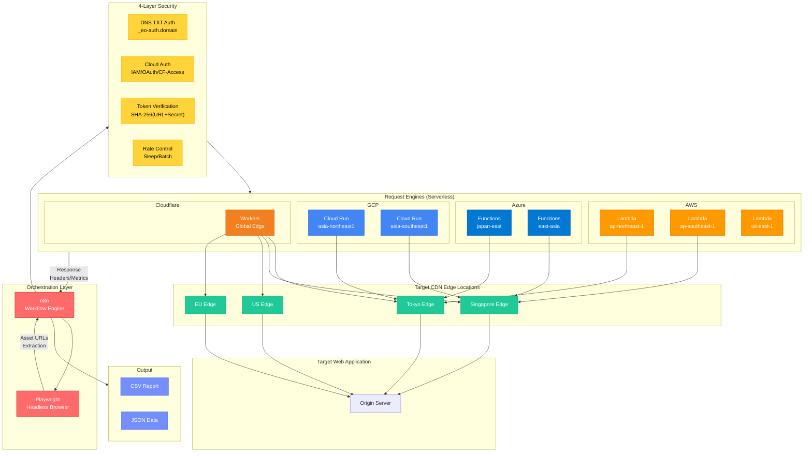
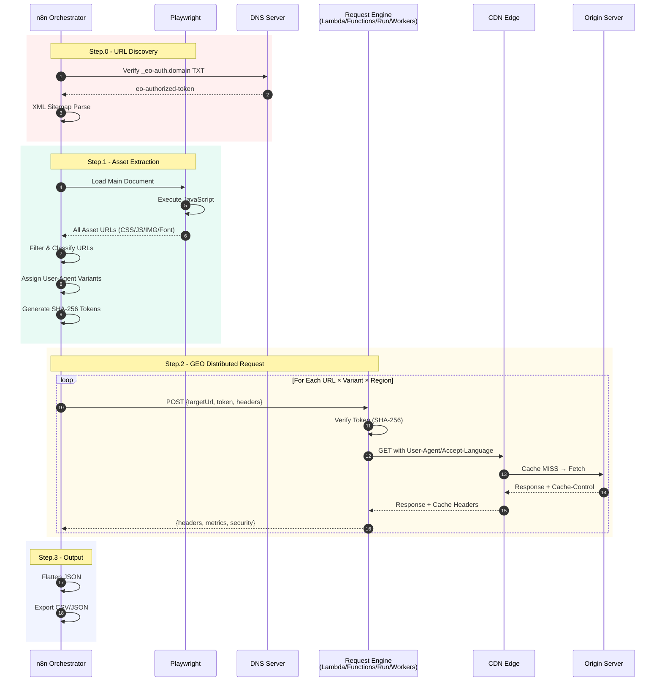
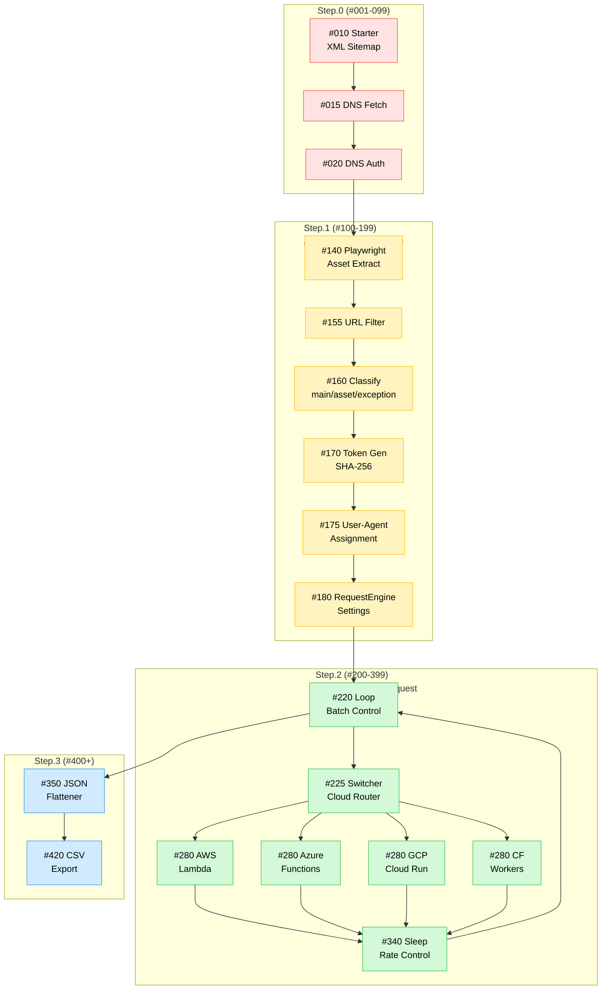
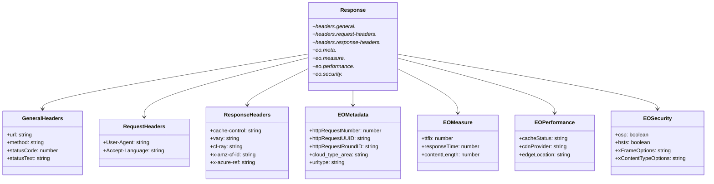
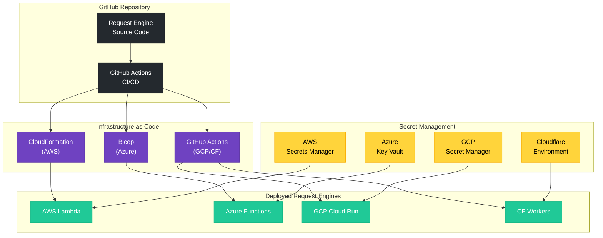
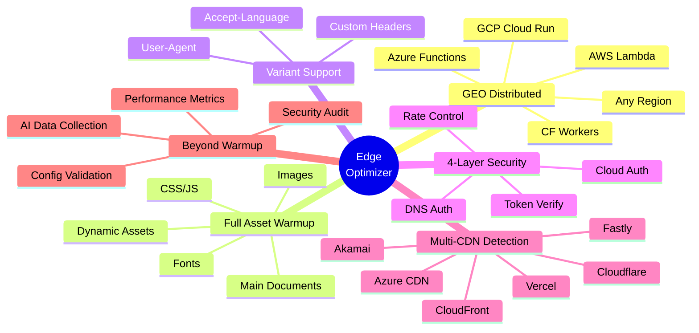

# Edge Optimizer Architecture

## System Overview

## Request Flow Sequence

## 4-Layer Security Model

```mermaid
flowchart LR
    subgraph Layer1["Layer 1: Domain Ownership"]
        dns["DNS TXT Record<br/>_eo-auth.example.com"]
    end

    subgraph Layer2["Layer 2: Cloud Authentication"]
        iam["AWS IAM<br/>Access Key"]
        azkey["Azure<br/>Function Key"]
        oauth["GCP OAuth2<br/>Service Account"]
        cfaccess["Cloudflare<br/>Access Token"]
    end

    subgraph Layer3["Layer 3: Token Verification"]
        token["SHA-256<br/>Hash(URL + Secret)"]
    end

    subgraph Layer4["Layer 4: Rate Control"]
        sleep["Random Sleep<br/>1000-3999ms"]
        batch["Batch Processing<br/>Loop Control"]
    end

    Layer1 --> Layer2 --> Layer3 --> Layer4

    classDef l1 fill:#ff6b6b,stroke:#c92a2a,color:#fff
    classDef l2 fill:#ffd43b,stroke:#fab005,color:#000
    classDef l3 fill:#20c997,stroke:#12b886,color:#fff
    classDef l4 fill:#748ffc,stroke:#4c6ef5,color:#fff

    class dns l1
    class iam,azkey,oauth,cfaccess l2
    class token l3
    class sleep,batch l4
```

## Data Flow & Variant Expansion

```mermaid
flowchart LR
    subgraph Input["Input"]
        sitemap["XML Sitemap<br/>100 URLs"]
    end

    subgraph Extraction["Asset Extraction"]
        pw["Playwright<br/>+500 Assets"]
    end

    subgraph Variants["Variant Expansion"]
        ua["User-Agent<br/>×2 variants"]
        lang["Accept-Language<br/>×2 languages"]
        region["Regions<br/>×4 clouds"]
    end

    subgraph Total["Total Requests"]
        calc["600 URLs<br/>× 2 UA<br/>× 2 Lang<br/>× 4 Regions<br/>= 9,600 Requests"]
    end

    subgraph Output["Output Data"]
        headers["Response Headers<br/>Cache-Control, Vary, CDN"]
        metrics["Performance Metrics<br/>TTFB, Response Time"]
        security["Security Headers<br/>CSP, HSTS, X-Frame"]
    end

    Input --> Extraction --> Variants --> Total --> Output

    classDef input fill:#e7f5ff,stroke:#339af0,color:#000
    classDef process fill:#fff3bf,stroke:#fcc419,color:#000
    classDef output fill:#d3f9d8,stroke:#40c057,color:#000

    class sitemap input
    class pw,ua,lang,region process
    class calc process
    class headers,metrics,security output
```

## n8n Workflow Node Structure

## Request Engine Response Schema

## Multi-Cloud Deployment

## Why Edge Optimizer?

