# EO Request Engine for GCP Cloud Run

GCP Cloud Run上で動作するRequest Engineの実装です。他の実装（Cloudflare Workers、AWS Lambda、Azure Functions）と同じレスポンス形式で動作し、マルチクラウド環境での一貫した動作を実現します。

**重要**: CloudRunリクエストエンジン接続認証と照合用リクエストシークレットによるトークン検証に関する命名や設定の詳細は、[EO_Documents\Manuals\RE_README.md](../RE_README.md) を参照してください。

# 概要

このRequest Engineは、GCP Cloud Run上でFlaskアプリケーションとして動作し、HTTPリクエストを実行してパフォーマンスメトリクス（TTFB、FCP、LCPなど）を測定します。

# 前提

- ローカルでDocker がインストール済み
- Python 3.13以上

# 特徴

- **Cloud Run**: コンテナベースのサーバーレス実行環境
- **Secret Manager連携**: GCP Secret Managerから照合用リクエストシークレットを取得
- **Service Account認証**: IAMベースの認証をサポート（OAuth2 Bearer Token）
- **統一レスポンス形式**: 他のRequest Engineと同じJSON形式でレスポンス
- **パフォーマンス測定**: TTFB、FCP近似値、LCP要素抽出、Critical Path解析
- **リトライ機能**: エクスポネンシャルバックオフによる自動リトライ

# 図解：デプロイ・認証・実行の統合アーキテクチャ（横型全体俯瞰）

[図解：デプロイ・認証・実行の統合アーキテクチャ（横型全体俯瞰）](#arch-diagram-overview)

# GCP・Azure・AWS・CF の構造イメージ対応表

| 階層 | **GCP (Cloud Run / Flask)** | **Azure (Functions)** | **AWS (Lambda)** | **CF (Cloudflare Workers)** | **役割** |
| :--- | :--- | :--- | :--- | :--- | :--- |
| **器 (Host)** | **Cloud Run サービス**<br>`https://[NAME].a.run.app` | **Function App**<br>`https://[APP].azurewebsites.net` | **Lambda 関数**<br>（API Gateway / Function URL で公開） | **Worker**<br>`https://[WORKER].[SUBDOMAIN].workers.dev` | サーバー、スケーリング、認証等の「箱」の管理。 |
| **中身 (Logic)** | **エンドポイント（関数名相当）**<br>`/[EndpointName]` | **関数 (Function)**<br>`/api/[FunctionName]` | **ハンドラ (Handler)**<br>イベント・パスに応じて1関数が実行 | **ルート・ハンドラ**<br>リクエスト URL に応じた処理 | 実際の個別処理（フェッチ等）を呼び出す窓口。 |

# GCP サーバーレス世代比較

EOでは、**Cloud Run（gen1）** を採用しています。

GCP サーバーレスは Cloud Functions → Cloud Run へ進化し、Cloud Run 自体にも実行環境の世代（gen1 / gen2）が存在します。

| サービス・世代 | 基盤 | サンドボックス | 最小メモリ | コールドスタート | 世代の特徴 |
| :--- | :--- | :--- | :--- | :--- | :--- |
| **Cloud Functions (第1世代)** | 旧世代 | gVisor | 128 MiB | 速い | 1リクエスト毎に1インスタンス。並行処理不可。 |
| **Cloud Functions (第2世代)** | Cloud Run | gVisor | 128 MiB | 速い | Cloud Run のサブセット。関数の枠組みに制限される。 |
| **Cloud Run gen1** ← EO採用 | **最新・主力** | gVisor | **128 MiB** | **速い** | **最高性能・最安。** 1インスタンスで多数のリクエストを同時処理可能。軽量ワークロード向け。 |
| **Cloud Run gen2** | 最新・主力 | microVM | 512 MiB | やや遅い | フル Linux 互換（全syscall、namespaces、cgroups）。NFS マウント対応。CPU/ネットワーク性能向上。料金は gen1 と同額。 |

### Cloud Run gen1 / gen2 の詳細比較

| 項目 | gen1 | gen2 |
| :--- | :--- | :--- |
| **サンドボックス技術** | gVisor（システムコールをエミュレーション） | microVM（フル Linux カーネル） |
| **Linux カーネル** | 4.4.0 | 5.15.60 |
| **Linux 互換性** | 大部分のシステムコールに対応（一部非対応） | 完全互換 |
| **コールドスタート** | **速い**（バーストトラフィックに強い） | やや遅い |
| **CPU 性能** | 標準 | **高速** |
| **ネットワーク性能** | 標準 | **高速**（パケットロス時に顕著） |
| **somaxconn** | 128 | **4096** |
| **最小メモリ** | **128 MiB** | 512 MiB |
| **NFS マウント** | 不可 | **可** |
| **Direct VPC egress** | 基本対応 | **最適化済み** |
| **料金** | 同一 | 同一 |

### EO Request Engine が gen1 を採用する理由

| 観点 | 判断 |
| :--- | :--- |
| **トラフィック特性** | n8n からの間欠的バースト呼び出し → コールドスタートの速さが重要 |
| **メモリ** | 128Mi で十分（gen2 は最小 512 MiB が必要） |
| **Linux 互換性** | Python + Flask + HTTP リクエスト処理のみ → gen1 で十分 |
| **NFS / VPC** | 不要 |
| **CPU 負荷** | 軽量（HTTP 転送 + SHA-256 検証程度） |

gen2 への変更が必要な場合は、デプロイコマンドに `--execution-environment gen2` を追加し、メモリを `512Mi` 以上に設定してください。

## Cloud Runにおける「2つのレイヤー」による効率化

Cloud Runは、**「Cloud Run 側の設定（器のサイズ）」**と**「gunicorn の設定（中身の処理能力）」**の 2 つのレイヤーを最適に組み合わせることで、外部フェッチの待ち時間を有効活用し、課金額を最小化する設計になっています。

1. **レイヤー1：Cloud Run Concurrency（器のサイズ）**
   - GCP側の入り口で「1つのコンテナに対して同時に流し込む最大リクエスト数」を設定します（デフォルト 80）。これにより、大量のリクエストが来てもインスタンスの起動数を抑え、基本料金を節約できます。
2. **レイヤー2：gunicorn Threads（中身の処理能力）**
   - コンテナ内部で実際にリクエストを並行して捌く「手の数」をスレッド（Python Threads）で定義します。外部サイトの返事待ちの間、別のスレッドが次の処理を進めることで、1つのインスタンスの能力を極限まで使い切ります。

# セットアップ概要

GCPは、組織を前提とした設計が必要です。

- GCP プロジェクト（プロジェクトのダッシュボードで視認可能）
  - 組織: `<GCP組織ドメイン>`
  - 組織ID: `<GCP組織ID>`
    - プロジェクト名: `<GCPプロジェクト名>`
      - 例) `eo-re-d01-pr-asne1`
      - 文字数制限: 30文字以内。
          - eo : multi cloud request engine
          - re : request-engine
          - d01 : dev01
          - pr : project
          - asne1 : asia-northeast1
    - プロジェクトID: `<GCPプロジェクトID>`
        - 例) `eo-re-d01-pr-asne1`
    - プロジェクト番号: `<GCPプロジェクト番号>`
    - タグ: タグキー `environment` / タグ値 `d01`（dev01の省略形。詳細は「プロジェクト作成と設定」を参照）
- 必要なGCP APIの選定と有効化
  - Cloud Functions API が有効
  - Cloud Build API が有効
  - Artifact Registry API が有効（GCRを使用する場合は不要）
  - Cloud Run Admin API が有効
  - Secret Manager API が有効
- Service Accountの作成と権限設定

## サービスアカウントID文字制約等の制限事項と略語

GCPはサービスアカウント命名で**IDは6〜30文字**。本ドキュメントでは御命名に合わせ、Deployer は `deploy`、OAuth2 Invoker は `oa2inv`（IDは oa2inv）を使用（文字数チェック: `eo-gsa-d01-deploy-asne1`=27文字、`eo-gsa-d01-oa2inv-asne1`=30文字、いずれも6〜30の制限内）。

1. 6文字以上、30文字以下
2. 小文字の英字 ( a-z )、数字 ( 0-9 )、ハイフン ( - ) のみを使用
3. 先頭と末尾は英字または数字である必要があります。ハイフンで開始または終了することはできません
4. サービスアカウント名(名前(表示名))と説明は、後で変えられる。サービスアカウントIDは変えられない。
5.一意のID(数字)と、サービスアカウントIDは異なる識別子。

EOプロジェクト略語
- eo : Edge Optimizer
- pr : Project
- re : Request Engine
- sa : Service Account
- oa2inv : OAuth2 Bearer / Invoker（IDは30文字制限のため oa2inv を使用。Runtime と紛らわしいため run ではなく inv）
- ghactions : GitHub Actions
- asne1 : Asia Northeast1
- d01 : dev01
- runtime : 実行主体 Cloud Run Runtime ( ＋ 照合用リクエストシークレット取得 )
- wif : Workload Identity Federation

## Service Account合計5件の用途と権限

| Service Account ID | 用途 | プロジェクトレベルロール(Action) | リソースレベルロール(Who)※オーナーロールを除く |
| --- | --- | --- | --- |
| `<GCPプロジェクトID>@appspot.gserviceaccount.com` | **App Engine デフォルト**<br>App Engine 有効化時に自動作成。App Engine アプリのデフォルトの実行主体。 | ●`roles/editor` (編集者) | ●`roles/editor` (編集者)<br>プリンシパル:<br>1. `serviceAccount:<GCPプロジェクト番号>-compute@developer.gserviceaccount.com` … **Compute Engine デフォルト SA**（編集者）。<br>2. `serviceAccount:<GCPプロジェクトID>@appspot.gserviceaccount.com` … **App Engine デフォルト SA**（編集者）。 |
| `<GCPプロジェクト番号>-compute@developer.gserviceaccount.com` | **Compute Engine デフォルト**<br>Compute Engine API 有効化時に自動作成。VM・Cloud Build 等のデフォルトの実行主体。本構成ではイメージビルドと Cloud Run デプロイの実行者として利用。 | ●`roles/editor` (編集者) | ●`roles/editor` (編集者)<br>プリンシパル:<br>1. `serviceAccount:<GCPプロジェクト番号>-compute@developer.gserviceaccount.com` … **Compute Engine デフォルト SA**（編集者）。<br>2. `serviceAccount:<GCPプロジェクトID>@appspot.gserviceaccount.com` … **App Engine デフォルト SA**（編集者）。<br>●`roles/iam.serviceAccountUser` (Compute Engine デフォルト SA のサービス アカウント ユーザー)<br>プリンシパル:<br>3. `serviceAccount:eo-gsa-d01-deploy-asne1@<GCPプロジェクトID>.iam.gserviceaccount.com` … **Deployer SA**（Compute Engine デフォルト SA のサービス アカウント ユーザー）。 |
| `eo-gsa-d01-runtime-asne1` | **実行主体（Cloud Run Runtime）＋ 照合用リクエストシークレット取得 (CloudRun_Runtime)**<br>Cloud RunリクエストエンジンがSecret Managerから照合用リクエストシークレットを取得するため | ●`roles/secretmanager.secretAccessor` (Secret Manager のシークレット アクセサー) | ●`roles/iam.serviceAccountUser` (Runtime SA のサービス アカウント ユーザー : Cloud Run の実行主体として Runtime SA をセットする権限)<br>プリンシパル:<br>1. `serviceAccount:<GCPプロジェクト番号>-compute@developer.gserviceaccount.com` … **Compute Engine デフォルト SA**（Runtime SA のサービス アカウント ユーザー）。イメージビルドと Cloud Run デプロイの実行主体。デプロイ時に「Cloud Run リクエストエンジンの実行 SA ＝ Runtime SA」を指定するため、Compute Engine デフォルト SA に Runtime SA を「使う」権限が必要。<br>2. `serviceAccount:eo-gsa-d01-deploy-asne1@<GCPプロジェクトID>.iam.gserviceaccount.com` … **Deployer SA**（Runtime SA のサービス アカウント ユーザー）。GitHub Actions が WIF でなりすまして(Impersonate)デプロイを指示する主体。デプロイ時に「Cloud Run リクエストエンジンの実行 SA ＝ Runtime SA」を指定するため、Deployer SA に Runtime SA を「使う」権限が必要。<br>●`roles/editor` (編集者)<br>プリンシパル:<br>3. `serviceAccount:<GCPプロジェクトID>@appspot.gserviceaccount.com` … **App Engine デフォルト SA**（編集者）。 |
| `eo-gsa-d01-deploy-asne1` | **デプロイ担当 (Deployer)**<br>GitHub Actions で Workload Identity OIDC 認証を経て Cloud Run をビルド・デプロイ | ●`roles/artifactregistry.admin` (Artifact Registry 管理者。ソースデプロイで `cloud-run-source-deploy` リポジトリ自動作成に必須)<br>●`roles/artifactregistry.repoAdmin` (Artifact Registry リポジトリ管理者。`artifactregistry.repositories.create` は含まれない)<br>●`roles/cloudbuild.builds.editor` (Cloud Build 編集者)<br>●`roles/run.admin` (Cloud Run 管理者)<br>●`roles/serviceusage.serviceUsageConsumer` (Service Usage ユーザー。各APIをコールする権限)<br>●`roles/storage.admin` (ストレージ管理者) | ●`roles/editor` (編集者)<br>プリンシパル:<br>1. `serviceAccount:<GCPプロジェクト番号>-compute@developer.gserviceaccount.com` … **Compute Engine デフォルト SA**（編集者）。<br>2. `serviceAccount:<GCPプロジェクトID>@appspot.gserviceaccount.com` … **App Engine デフォルト SA**（編集者）。<br>●`roles/iam.workloadIdentityUser` (Deployer SA の Workload Identity ユーザー)<br>プリンシパル:<br>3. `principalSet://iam.googleapis.com/projects/<GCPプロジェクト番号>/locations/global/workloadIdentityPools/eo-gcp-pool-wif-d01/attribute.repository/<Github組織名orユーザー名>/<Githubリポジトリ名>` … GitHub Actions からの WIF 紐付け。 |
| `eo-gsa-d01-oa2inv-asne1` | **OAuth2 Bearerトークン認証用 (OAuth2_Invoker)**<br>n8n HTTP RequestノードがリクエストエンジンCloud Runへ接続する際の認証。JSONキーを発行し、n8nのCredentialsに登録。 | 無し | ●`roles/editor` (編集者)<br>プリンシパル:<br>1. `serviceAccount:<GCPプロジェクト番号>-compute@developer.gserviceaccount.com` … **Compute Engine デフォルト SA**（編集者）。<br>2. `serviceAccount:<GCPプロジェクトID>@appspot.gserviceaccount.com` … **App Engine デフォルト SA**（編集者）。<br>●`roles/iam.serviceAccountTokenCreator` (OAuth2 Invoker SA のサービス アカウント トークン作成者)<br>プリンシパル:<br>3. `serviceAccount:eo-gsa-d01-oa2inv-asne1@<GCPプロジェクトID>.iam.gserviceaccount.com` … **OAuth2 Invoker SA**（OAuth2 Invoker SA 自身へのトークン作成者。EOn8nWorkflowJson の n8n-workflow.json 内「235 Get IDtoken From GCP Service Account Access Token」ノードで ID トークンを受け取るため）。 |

**GCPコンソールでの権限確認場所**

- **[A] プロジェクトレベルロール (このSAが「何ができるか」)**
  - `IAMと管理` > `IAM` > リストから該当SAを探して確認
- **[B] リソースレベルロール (このSAを「誰が使えるか」)**
  - `IAMと管理` > `サービス アカウント` > 該当SAのメールを押下 > **「アクセス権を持つプリンシパル」** タブ
  - (画面内の「このサービス アカウントへのアクセス権を持つプリンシパル」一覧に表示されます)

**サービスアカウントが呼び出される流れ**

```
Deployer SA … GitHub Actions が WIF で Cloud Run をビルド・デプロイするため
↓
Compute Engine デフォルト SA … イメージビルドと Cloud Run デプロイを実際に実行するため
↓
Runtime SA … デプロイされた Cloud Run の実行主体として稼働し、Secret Manager から照合用リクエストシークレットを取得するため
↓
OAuth2 Invoker SA … n8n の「235 Get IDtoken From GCP Service Account Access Token」ノードで ID トークンを受け取り、リクエストエンジン Cloud Run へ接続するため
```

## CloudShell環境変数設定
- EX) `export EO_GCP_PROJECT_ID="eo-re-d01-pr-asne1"`
```bash
export GCP_ORGANIZATION_DOMAIN="<GCP組織ドメイン>"
export GCP_ORGANIZATION_ID="<GCP組織ID>"
export EO_GCP_PROJECT_ID="<GCPプロジェクトID>"
export EO_GCP_PROJECT_NUMBER="<GCPプロジェクト番号>"
export EO_GCP_PROJECT_GITHUB_ORG_or_USER="<Github組織名orユーザー名>"
export EO_GCP_PROJECT_GITHUB_REPO="<Githubリポジトリ名>"
# 照合用リクエストシークレット（EO_Infra_Docker/.env の N8N_EO_REQUEST_SECRET と同じ値）
export N8N_EO_REQUEST_SECRET="<N8N_EO_REQUEST_SECRETの値>"
# 必要に応じて利用
# export EO_GCP_PROJECT_CLOUDSHELL_ROOT_DIRECTORY="<プロジェクトCLOUDSHELLルートディレクトリ>"
# export EO_GCP_PROJECT_LOCAL_ROOT_DIRECTORY="<プロジェクトローカルルートディレクトリ>"
```
## Service Accountロール確認コマンド例

サービスアカウント作成しないと結果返ってこない

```bash
# App Engine デフォルト
export APPENGINE_SA="${EO_GCP_PROJECT_ID}@appspot.gserviceaccount.com"
# Compute Engine デフォルト
export COMPUTEENGINE_SA="${EO_GCP_PROJECT_NUMBER}$-compute@developer.gserviceaccount.com"
# 実行主体（Cloud Run Runtime）＋ 照合用リクエストシークレット取得 (CloudRun_Runtime)
export RUNTIME_SA="eo-gsa-d01-runtime-asne1@${EO_GCP_PROJECT_ID}.iam.gserviceaccount.com"
# デプロイ担当 (Deployer)
export DEPLOY_SA="eo-gsa-d01-deploy-asne1@${EO_GCP_PROJECT_ID}.iam.gserviceaccount.com"
# OAuth2 Bearerトークン認証用 (OAuth2_Invoker)
export OAUTH2_INVOKER_SA="eo-gsa-d01-oa2inv-asne1@${EO_GCP_PROJECT_ID}.iam.gserviceaccount.com"

# 確認対象を指定 (例: CloudRun_Runtime の権限を確認したい場合)
export TARGET_SA_EMAIL=$RUNTIME_SA
```

1. プロジェクトレベルのロール確認(Run 管理者、Storage 管理者など)
```bash
gcloud projects get-iam-policy $EO_GCP_PROJECT_ID \
    --flatten="bindings[].members" \
    --filter="bindings.members:serviceAccount:${TARGET_SA_EMAIL}" \
    --format="table(bindings.role)"
```

2. リソースレベル（SA自体）の権限確認 (actAs / 借用権限の確認)
```bash
# 対象の SA に対して、誰が「なりすまし(actAs)」を許可されているかを確認
gcloud iam service-accounts get-iam-policy ${TARGET_SA_EMAIL} --project=$EO_GCP_PROJECT_ID
```

## 自動権限チェックスクリプト

ドキュメントに記載されている権限設定と実機の設定を自動で比較するスクリプトを用意しています。

**実行方法（Windows環境）**:

### 方法1: Google Cloud Shell（推奨）

1. [Google Cloud Console](https://console.cloud.google.com/) にアクセス
2. 右上の **Cloud Shell** アイコン（`>_`）をクリック
3. プロジェクトを設定:
   ```bash
   gcloud config set project ${EO_GCP_PROJECT_ID}
   ```
4. スクリプトをアップロードまたは直接作成:
   ```bash
   # Cloud Shellエディタで check_service_account_permissions.sh を開く
   # または、ローカルからアップロード
   ```
5. 実行:
   ```bash
   chmod +x check_service_account_permissions.sh
   ./check_service_account_permissions.sh
   ```

### 方法2: WSL (Windows Subsystem for Linux)

1. WSLを起動（例: `wsl`）
2. プロジェクトディレクトリに移動:
   ```bash
   export EO_GCP_PROJECT_LOCAL_ROOT_DIRECTORY="<プロジェクトローカルルートディレクトリ>"
   cd /${EO_GCP_PROJECT_LOCAL_ROOT_DIRECTORY}/RequestEngine/gcp/cloudrun/py
   ```
3. gcloud CLIがインストールされていることを確認:
   ```bash
   gcloud --version
   ```
4. 認証:
   ```bash
   gcloud auth login
   gcloud config set project ${EO_GCP_PROJECT_ID}
   ```
5. 実行:
   ```bash
   chmod +x check_service_account_permissions.sh
   ./check_service_account_permissions.sh
   ```

### 方法3: Git Bash（gcloud CLIがインストールされている場合）

1. Git Bashを起動
2. プロジェクトディレクトリに移動:
   ```bash
   export EO_GCP_PROJECT_LOCAL_ROOT_DIRECTORY="<プロジェクトローカルルートディレクトリ>"
   cd /${EO_GCP_PROJECT_LOCAL_ROOT_DIRECTORY}/RequestEngine/gcp/cloudrun/py
   ```
3. 認証とプロジェクト設定:
   ```bash
   gcloud auth login
   gcloud config set project ${EO_GCP_PROJECT_ID}
   ```
4. 実行:
   ```bash
   bash check_service_account_permissions.sh
   ```

### 方法4: PowerShell（手動でコマンドを実行）

PowerShellから直接gcloudコマンドを実行して確認:

```powershell
# 環境変数設定
$env:EO_GCP_PROJECT_ID = "<GCPプロジェクトID>"
$env:DEPLOY_SA = "eo-gsa-d01-deploy-asne1@${env:EO_GCP_PROJECT_ID}.iam.gserviceaccount.com"
$env:RUNTIME_SA = "eo-gsa-d01-runtime-asne1@${env:EO_GCP_PROJECT_ID}.iam.gserviceaccount.com"

# Deployer SAのプロジェクトレベルロール確認
gcloud projects get-iam-policy $env:EO_GCP_PROJECT_ID `
    --flatten="bindings[].members" `
    --filter="bindings.members:serviceAccount:${env:DEPLOY_SA}" `
    --format="table(bindings.role)"

# Runtime SAのプロジェクトレベルロール確認
gcloud projects get-iam-policy $env:EO_GCP_PROJECT_ID `
    --flatten="bindings[].members" `
    --filter="bindings.members:serviceAccount:${env:RUNTIME_SA}" `
    --format="table(bindings.role)"
```

**チェック内容**:
1. Deployer SA のプロジェクトレベルロール（5つのロール）
2. Runtime SA のプロジェクトレベルロール（1つのロール）
3. Deployer SA のリソースレベルロール（WIFプリンシパル）
4. OAuth2_Invoker SA のリソースレベルロール（自分自身へのトークン作成権限）
5. Runtime SA のリソースレベルロール（Cloud Build & Deployer SAからの借用権限）
6. OAuth2_Invoker SA の Cloud Run Invokerロール（サービス起動権限）

**注意**: このスクリプトは、CloudRun_README.mdに記載されている期待される権限と実機の設定を比較します。差分が見つかった場合は、エラーメッセージと共に修正コマンドが表示されます。

## GCPプロジェクトの箱だけ作成後デフォルトで有効化されているAPI 2026/1/19時点

サービスリストコマンド実行
```
gcloud services list --enabled --format="value(TITLE,STATE)"
```
結果
```
Analytics Hub API       ENABLED
App Optimize API        ENABLED
BigQuery API    ENABLED
BigQuery Connection API ENABLED
BigQuery Data Policy API        ENABLED
BigQuery Data Transfer API      ENABLED
BigQuery Migration API  ENABLED
BigQuery Reservation API        ENABLED
BigQuery Storage API    ENABLED
Gemini for Google Cloud API     ENABLED
Google Cloud APIs       ENABLED
Cloud Asset API ENABLED
Cloud Trace API ENABLED
Dataform API    ENABLED
Cloud Dataplex API      ENABLED
Cloud Datastore API     ENABLED
Gemini Cloud Assist API ENABLED
Cloud Logging API       ENABLED
Cloud Monitoring API    ENABLED
Recommender API ENABLED
Service Management API  ENABLED
Service Usage API       ENABLED
Cloud SQL       ENABLED
Google Cloud Storage JSON API   ENABLED
Cloud Storage   ENABLED
Cloud Storage API       ENABLED
```

## セットアップ進めると勝手に有効化される可能性があるGCPのAPI

**注意**: 以下の情報は、特定の操作や組織ポリシー、プロジェクトの状態によっては自動有効化される場合があることを示していますが、**公式ドキュメントでは明示的な有効化が推奨されています**。確実に動作させるためには、必要なAPIを明示的に有効化してください。

GCPは、一部の高レベル操作を実行する際に、必要な下位APIを自動的に有効化する場合があります。ただし、この動作は保証されず、組織ポリシーやプロジェクトの状態によって異なります。

**自動有効化される可能性があるAPI**:

- **Identity and Access Management (IAM) API**
  - 多くのIAM操作で必要になるため、初回使用時に自動有効化される場合がある
  - Cloud Run / Functions を使用する際に、初回操作で自動有効化される可能性がある
- **IAM Service Account Credentials API**
  - IAM APIと同様に、初回使用時に自動有効化される場合がある
- **Cloud Resource Manager API**
  - プロジェクト情報の取得やIAM操作で使用される
  - Cloud Consoleでの操作時に自動有効化される場合がある
- **Cloud Pub/Sub API**
  - Cloud Functions / Run のイベントトリガー（Eventarc）を使用する場合に必要
  - Pub/Subトリガーを設定する際に、初回操作で自動有効化される可能性がある
- **Container Registry API**
  - Artifact Registry を使用する際の後方互換性のために有効化される場合がある
  - **注意**: 現代の構成ではArtifact Registry APIを使用することが推奨される
  - 非推奨のため、明示的に有効化する必要はない
- **Legacy Cloud Source Repositories API**
  - Cloud Build の一部機能で使用される場合がある
  - Cloud Consoleの「リポジトリ接続」画面を開いた際に自動有効化される場合がある
  - 現代構成ではほぼ不要（GitHub連携などで代替可能）

**重要な注意事項**:
- これらのAPIが自動有効化されることは**保証されません**
- 確実に動作させるためには、必要なAPIを明示的に有効化してください
- 組織ポリシーやプロジェクトの設定によって、自動有効化の動作は異なります

## gcloud CLI のインストール

**GUIのCloudShellが利用可能なため、基本的にインストール不要**

**Windowsの場合**:
Google Cloud SDK インストーラーをダウンロードして実行
```powershell
(New-Object Net.WebClient).DownloadFile("https://dl.google.com/dl/cloudsdk/channels/rapid/GoogleCloudSDKInstaller.exe", "$env:Temp\GoogleCloudSDKInstaller.exe") & $env:Temp\GoogleCloudSDKInstaller.exe
```

インストール後、Pathを通す:
- デフォルトのインストールパス: `C:\Users\<ユーザー名>\AppData\Local\Google\Cloud SDK\google-cloud-sdk\bin`

**初期化**:

gcloud CLIを初期化
```bash
gcloud init
```

プロジェクトを設定
```bash
gcloud config set project ${EO_GCP_PROJECT_ID}
```

バージョン確認
```bash
gcloud --version
```

現在のプロジェクト確認
```bash
gcloud config list project
```

認証状態確認
```bash
gcloud auth list
```

**注意**
1. `gcloud init`を実行すると、ブラウザGUIでサインインが求められます。既にサインイン済みの場合は、そのまま認証されます。
2. CloudShellは、セッションが短いのですぐに切れる。同じプロジェクト内なら、ブラウザでリロードすればOK。

# GCP プロジェクトの準備

このセクションでは、Google Cloud プロジェクトの作成、課金設定、および必要な API の有効化を行います。

## [Google Cloud Console GUI / gcloud CLI] プロジェクト作成と設定
1. **Google Cloud Console GUI** ([https://console.cloud.google.com/](https://console.cloud.google.com/)) にアクセス
2. 上部のプロジェクト選択プルダウンから、**新しいプロジェクトを作成**するか、既存のプロジェクトを選択
   - (GCP)プロジェクト名: `<GCPプロジェクト名>`（30文字以内の制限あり）
        - 例) `eo-re-d01-pr-asne1`
   - (GCP)プロジェクト番号: `<GCPプロジェクト番号>`
   - (GCP)プロジェクトID: `<GCPプロジェクトID>`
        - 例) `eo-re-d01-pr-asne1`
   - **タグ（推奨）** タグキー:`environment`、タグの値:`d01`。タグキー・タグ値が未作成なら 1→2→3、既にあるなら 3 だけ実行。
     ```
     gcloud resource-manager tags keys create environment --parent=organizations/${GCP_ORGANIZATION_ID}
     ```
     ```
     gcloud resource-manager tags values create d01 --parent=organizations/${GCP_ORGANIZATION_ID}/environment
     ```
     ```
     gcloud resource-manager tags bindings create --tag-value=organizations/${GCP_ORGANIZATION_ID}/environment/d01 --parent=//cloudresourcemanager.googleapis.com/projects/${EO_GCP_PROJECT_ID}
     ```

※プロジェクトを作るだけで有効化されるAPIがある。
Disableできない/すると壊れる APIはおもに以下。
- IAM API
- Resource Manager API
- Service Usage API

「Cloud NGFW で使用する」は、必要に応じて有効化。

## 有効化済 API / サービスのみ一覧 CloudShell確認方法

APIの有効化年月日時分秒は表示できない。

サービス名だけ
```
gcloud services list --enabled --format="value(TITLE,STATE)"
```
APIのURLだけ
```
gcloud services list --enabled --format="value(NAME,STATE)"
```
両方
```
gcloud services list --enabled --format="value(TITLE,NAME,STATE)"
```

プロジェクト指定（CloudShellでプロジェクトIDが黄色文字で表示される）
```
gcloud services list --enabled --format="value(TITLE,STATE)" --project=$EO_GCP_PROJECT_ID
```

## 必要なAPIの有効化

EO Request Engineは、以下のAPIを明示的に有効化する必要があります。
**注意**: APIの有効化には数分かかる場合があります。

**方法1: Google Cloud Console GUI で有効化**

1. 左上のメニュー（三本線）から **「API とサービス」 > 「ライブラリ」** を選択
2. 検索バーで以下のAPIを検索し、それぞれ **「有効にする」** をクリック:
   - **Cloud Functions API** (`cloudfunctions.googleapis.com`) - Cloud Functions (第1・2世代) のデプロイや設定管理
   - **Cloud Build API** (`cloudbuild.googleapis.com`) -  CI/CDパイプラインの一部を自動化コンテナイメージのビルドに必要
   - **Artifact Registry API** (`artifactregistry.googleapis.com`) - コンテナイメージやパッケージなどのアーティファクトを一元的に保存・管理（GCRを使用する場合は不要）
   - **Cloud Run Admin API** (`run.googleapis.com`) - Cloud Run サービスのデプロイ、設定、トラフィック管理など
   - **Secret Manager API** (`secretmanager.googleapis.com`) - シークレットの取得に必要

※Cloud Run APIというAPIは存在しない。

**方法2: gcloud CLIで有効化（推奨）**

プロジェクトID設定
```bash
export EO_GCP_PROJECT_ID="<GCPプロジェクトID>"
gcloud config set project $EO_GCP_PROJECT_ID
```

CloudShellで必要なAPIを有効化するコマンド
```
gcloud services enable cloudfunctions.googleapis.com
gcloud services enable cloudbuild.googleapis.com
gcloud services enable artifactregistry.googleapis.com
gcloud services enable run.googleapis.com
gcloud services enable secretmanager.googleapis.com
```

結果応答(1個足りない。)gcloud services enable コマンドはAPIと1対1ではない。カオス。

```
Operation "operations/acf.p2-<GCPプロジェクト番号>-c39fbeb3-9e1d-4832-9c53-7ca15ad45a67" finished successfully.
Operation "operations/acf.p2-<GCPプロジェクト番号>-3a7f1b64-c250-4b07-839b-46549690f23c" finished successfully.
Operation "operations/acf.p2-<GCPプロジェクト番号>-7c165856-975e-436a-8d9d-7ad7ff7e4543" finished successfully.
Operation "operations/acat.p2-<GCPプロジェクト番号>-f1d77059-b207-44ff-8034-96011a9445bc" finished successfully.
```

確認コマンド（10個増えている。）
```
gcloud services list --enabled --format="value(TITLE,STATE)"

Analytics Hub API       ENABLED
App Optimize API        ENABLED
Artifact Registry API   ENABLED
BigQuery API    ENABLED
BigQuery Connection API ENABLED
BigQuery Data Policy API        ENABLED
BigQuery Data Transfer API      ENABLED
BigQuery Migration API  ENABLED
BigQuery Reservation API        ENABLED
BigQuery Storage API    ENABLED
Gemini for Google Cloud API     ENABLED
Google Cloud APIs       ENABLED
Cloud Asset API ENABLED
Cloud Build API ENABLED
Cloud Functions API     ENABLED
Cloud Trace API ENABLED
Container Registry API  ENABLED
Dataform API    ENABLED
Cloud Dataplex API      ENABLED
Cloud Datastore API     ENABLED
Gemini Cloud Assist API ENABLED
Identity and Access Management (IAM) API        ENABLED
IAM Service Account Credentials API     ENABLED
Cloud Logging API       ENABLED
Cloud Monitoring API    ENABLED
Cloud Pub/Sub API       ENABLED
Recommender API ENABLED
Cloud Run Admin API     ENABLED
Secret Manager API      ENABLED
Service Management API  ENABLED
Service Usage API       ENABLED
Legacy Cloud Source Repositories API    ENABLED
Cloud SQL       ENABLED
Google Cloud Storage JSON API   ENABLED
Cloud Storage   ENABLED
Cloud Storage API       ENABLED
```

【参考】無効化コマンド
```
gcloud services disable cloudfunctions.googleapis.com
```
Cloud Functions API を無効にして、再度有効にした場合、既存の関数やその設定は基本的に保持されたまま再度有効化される。

# Secret Manager による照合用リクエストシークレットの管理

**重要**: シークレット名は、コード内で使用されている`eo-re-d01-secretmng`と一致させる必要があります。

**ポイント** GCPのシークレットは、デフォルトでレプリケーションポリシーにより、シークレットがどこに保存されるかは自動的に管理され、すべてのシークレットはどのように複製され保存されているかにかかわらず、グローバルにアクセス可能

## 方法1: Google Cloud Console GUI でシークレット作成

1. 左上のメニューから **「セキュリティ」 > 「Secret Manager」** を選択
2. 上部の **「シークレットを作成」** をクリック
3. **名前**: `eo-re-d01-secretmng` と入力
   - **重要**: コード内の `CLOUDRUN_REQUEST_SECRET_NAME = "eo-re-d01-secretmng"` と一致させる必要があります
4. **シークレットの値**:
   - テキスト形式の場合: `EO_Infra_Docker/.env`の`N8N_EO_REQUEST_SECRET`の値をそのまま入力
   - JSON形式の場合（将来の実装予定）: 以下のJSONを入力
     ```json
     {
       "CLOUDRUN_REQUEST_SECRET": "your-secret-value"
     }
     ```
   - **重要**: `your-secret-value`の部分は、`EO_Infra_Docker/.env`の`N8N_EO_REQUEST_SECRET`と**全く同じ文字列**に設定してください
5. **リージョン**: asne1（`asia-northeast1`、自動レプリケーション）
6. その他はデフォルトのまま、最下部の **「シークレットを作成」** をクリック

**更新方法**:「+ 新しいバージョン」をクリック、新しいバージョンを入力、「新しいバージョン」をクリックすると値を変更できる。古いバージョンの保管は「無効」も課金対象で破棄する必要あり。

## 方法2: gcloud CLIで作成

**注意**: 環境変数 `$N8N_EO_REQUEST_SECRET`（CloudShell環境変数設定で設定済み）を使用します。リージョン無しで命名する。

**JSON形式シークレット**

```bash
printf '{"CLOUDRUN_REQUEST_SECRET":"%s"}' "$N8N_EO_REQUEST_SECRET" | gcloud secrets create eo-re-d01-secretmng \
  --data-file=- \
  --replication-policy="automatic" \
  --project=$EO_GCP_PROJECT_ID
```

※CloudShellで該当プロジェクトとして黄色文字が表示されていれば、`--project=$EO_GCP_PROJECT_ID`不要。

**シークレットが正しく作成されたか確認**

```bash
gcloud secrets list --project=$EO_GCP_PROJECT_ID
```

**シークレットの値を確認（権限が必要）**
```
gcloud secrets versions access latest --secret="eo-re-d01-secretmng" --project=$EO_GCP_PROJECT_ID
```
# GCP Service Account 3件 作成

**【重要】サービスアカウントID文字制約等の制限事項**

サービスアカウント命名ミスると理解コスト高騰します。

1. 小文字の英字 ( a-z )、数字 ( 0-9 )、ハイフン ( - ) のみを使用
2. 6文字以上、30文字以下
3. 先頭と末尾は英字または数字である必要があります。ハイフンで開始または終了することはできません
4. 「サービスアカウント名(名前(表示名))」と「説明」は、作成後に変更出来る。**サービスアカウントIDは作成後に変更出来ない。**
5. サービスアカウント(SA)の「一意のID(数字)」と、「サービスアカウントID」は異なる識別子。
6. プロジェクトレベルのSAロールは `IAMと管理`>`IAM`画面、個別リソース単位のSAロールは`IAMと管理`>`サービスアカウント`の「アクセス権を持つプリンシパル」タブ、と2段階に分かれている。すぐ下に記載。
7. **削除後の即時再作成は避ける**: 同じプロジェクト・同じIDでSAを「削除 ➔ 直後に再作成」すると、古いSAの権限情報がキャッシュとして残っていたり、逆に新しいSAに権限が引き継がれなかったりと、IAMの伝播遅延による不可解なエラーに数時間ハマることがあります。

## GCPコンソールでSAのロール(権限)2段階の確認場所

- **[A] プロジェクトレベルロール (このSAが「何ができるか」)**
  - `IAMと管理` > `IAM` > リストから該当SAを探して確認
- **[B] リソースレベルロール (このSAを「誰が使えるか」)**
  - `IAMと管理` > `サービス アカウント` > 該当SAのメールを押下 > **「アクセス権を持つプリンシパル」** タブ


# サービスアカウントの作成と権限設定

リクエストエンジンに必要な3つのサービスアカウントを作成し、最小権限（Least Privilege）を適用した検証済み構成で設定します。

```bash
export EO_GCP_PROJECT_ID="<GCPプロジェクトID>"
export EO_GCP_PROJECT_NUMBER=$(gcloud projects describe $EO_GCP_PROJECT_ID --format='value(projectNumber)')

# 1. サービスアカウントの作成
# [Deployer]: デプロイ担当, [OAuth2_Invoker]: OAuth2認証担当, [CloudRun_Runtime]: 実行主体（リフレッシュトークンや照合用リクエストシークレット取得用）
gcloud iam service-accounts create eo-gsa-d01-deploy-asne1 --display-name="EO GCP Deployer SA (asne1)" --project=$EO_GCP_PROJECT_ID
gcloud iam service-accounts create eo-gsa-d01-oa2inv-asne1 --display-name="EO GCP OAuth2 Invoker SA (asne1)" --project=$EO_GCP_PROJECT_ID
gcloud iam service-accounts create eo-gsa-d01-runtime-asne1 --display-name="EO GCP Cloud Run Runtime SA (asne1)" --project=$EO_GCP_PROJECT_ID

# 2. プロジェクトレベルのロール付与
# [Deployer SA] への権限（Cloud Run 管理、ビルド、ストレージ等）
gcloud projects add-iam-policy-binding $EO_GCP_PROJECT_ID --member="serviceAccount:eo-gsa-d01-deploy-asne1@${EO_GCP_PROJECT_ID}.iam.gserviceaccount.com" --role="roles/run.admin"
gcloud projects add-iam-policy-binding $EO_GCP_PROJECT_ID --member="serviceAccount:eo-gsa-d01-deploy-asne1@${EO_GCP_PROJECT_ID}.iam.gserviceaccount.com" --role="roles/cloudbuild.builds.editor"
gcloud projects add-iam-policy-binding $EO_GCP_PROJECT_ID --member="serviceAccount:eo-gsa-d01-deploy-asne1@${EO_GCP_PROJECT_ID}.iam.gserviceaccount.com" --role="roles/serviceusage.serviceUsageConsumer"
gcloud projects add-iam-policy-binding $EO_GCP_PROJECT_ID --member="serviceAccount:eo-gsa-d01-deploy-asne1@${EO_GCP_PROJECT_ID}.iam.gserviceaccount.com" --role="roles/storage.admin"
# 必須: ソースデプロイ時に cloud-run-source-deploy リポジトリを自動作成するため artifactregistry.repositories.create が必要。roles/artifactregistry.repoAdmin に含まれる。
gcloud projects add-iam-policy-binding $EO_GCP_PROJECT_ID --member="serviceAccount:eo-gsa-d01-deploy-asne1@${EO_GCP_PROJECT_ID}.iam.gserviceaccount.com" --role="roles/artifactregistry.repoAdmin"

# [CloudRun_Runtime SA] への権限 (Secret Managerアクセス)
gcloud projects add-iam-policy-binding $EO_GCP_PROJECT_ID --member="serviceAccount:eo-gsa-d01-runtime-asne1@${EO_GCP_PROJECT_ID}.iam.gserviceaccount.com" --role="roles/secretmanager.secretAccessor"

# 3. リソースレベル（SA自体）の権限付与 (なりすまし許可 / actAs)
# [CloudRun_Runtime SA] を [Cloud Build] および [Deployer SA] が「着れる」ようにする（デプロイ時に必要）
# 注意: Cloud Run で SA を指定してデプロイする場合、実行者（Deployer SA）にこの権限が必要です。

# Cloud Build(Runtime) サービスアカウントへの付与
gcloud iam service-accounts add-iam-policy-binding eo-gsa-d01-runtime-asne1@${EO_GCP_PROJECT_ID}.iam.gserviceaccount.com \
    --member="serviceAccount:${EO_GCP_PROJECT_NUMBER}@cloudbuild.gserviceaccount.com" \
    --role="roles/iam.serviceAccountUser" --project=$EO_GCP_PROJECT_ID

# Deployer サービスアカウントへの付与
gcloud iam service-accounts add-iam-policy-binding eo-gsa-d01-runtime-asne1@${EO_GCP_PROJECT_ID}.iam.gserviceaccount.com \
    --member="serviceAccount:eo-gsa-d01-deploy-asne1@${EO_GCP_PROJECT_ID}.iam.gserviceaccount.com" \
    --role="roles/iam.serviceAccountUser" \
    --project=$EO_GCP_PROJECT_ID
```

## [Google Cloud Console GUI] サービスアカウントの作成と権限設定

1. **IAM と管理** > **サービス アカウント** を選択
2. **「サービス アカウントを作成」** をクリックし、以下の3つを作成します：
   - `eo-gsa-d01-deploy-asne1` (表示名: EO GCP Deployer SA (asne1))
   - `eo-gsa-d01-oa2inv-asne1` (表示名: EO GCP OAuth2 Invoker SA (asne1))
   - `eo-gsa-d01-runtime-asne1` (表示名: EO GCP Cloud Run Runtime SA (asne1))
3. **プロジェクトレベルのロール付与**:
   - **IAM と管理** > **IAM** を選択し、**「アクセスを許可」**（または **「メンバーを追加」**）をクリック
   - `deploy` [Deployer SA] に **`Cloud Run 管理者`**, **`Cloud Build 編集者`**, **`Service Usage コンシューマ`**, **`ストレージ管理者`**, **`Artifact Registry リポジトリ管理者`** を付与（**Artifact Registry リポジトリ管理者**はソースデプロイ時に `cloud-run-source-deploy` リポジトリを自動作成するために必須。付与しないと `artifactregistry.repositories.create` で 403 になる）
   - `runtime` [CloudRun_Runtime SA] に **`Secret Manager のシークレット参照者`** を付与
4. **リソースレベルの権限付与 (なりすまし許可)**:
   - 各サービスアカウントの詳細画面 > **「アクセス権を持つプリンシパル」** タブ > **「+ アクセスを許可」** で追加
   - `runtime` [CloudRun_Runtime SA] に対し、`Cloud Build` サービスアカウント（`プロジェクト番号@cloudbuild.gserviceaccount.com`）を**プリンシパル**として追加し、**`サービス アカウント ユーザー`** ロールを付与
   - `oau2be` [OAuth2_Invoker SA] に対し、自分自身（`oau2be` SA）をプリンシパルとして追加し、**`サービス アカウント トークン作成者`** ロールを付与

## [重要] コンソール画面での設定・鍵管理

SA作成後、jsonキーのダウンロードが必要。

### 1. OAuth2_Invoker の JSONキー発行と n8n 登録
- **鍵の発行**: 
  1. `eo-gsa-d01-oa2inv-asne1` の詳細画面 > **「鍵」** タブ > **「キーを追加」** > 「新しい鍵を作成」 > **JSON** > 「作成」
  2. ダウンロードされたJSONファイルを保管します。
      - ファイル名の後方を`-Oauth2_Invoker-jsonkey-yyyymmdd.json`のように変えておくとわかりやすい。
- **n8n Credentialsへの設定**: 
  - `Google Service Account API` 認証情報を作成し、JSONの内容を転記します。
      - Credentialの名前：`EO_RE_GCP_RUN_asne1_OAuth2_Invoker_SA`
  - **重要**: `private_key` フィールドの改行文字（`\n`）を含めた**そのままの形式**で貼り付けてください。
  - 詳細は EO_Documents\Manuals\RE_README.md を参照。

### 2. Cloud Shell からのキー・ファイル管理
- **ダウンロード**: 
  1. Cloud Shell 上部の **「エディタを開く」**。
  2. 左側 EXPLORER でファイルを選択し、右クリック > **「Download」**。
- **後始末**: 
  - セキュリティのため、ローカルに保存した後は Cloud Shell 上の `.json` ファイルを削除してください（`rm *.json`）。


## 前提条件

# Workload Identity 連携による GitHub Actions の認証設定

GitHub Actions から GCP に安全にアクセスするため、Workload Identity Federation を設定

> **Workload Identity PoolとProviderの関係**:
> - **Workload Identity Pool** (`eo-gcp-pool-wif-d01`): **1つのPoolに複数のProviderを登録可能**なコンテナです。複数の外部IDP（GitHub Actions、AWS、Azure ADなど）を1つのPool内で管理できます。
>   - **制限**: 1つのPoolに登録できるProviderの数は、Workforce Identity Poolの場合は**最大200個**、Workload Identity Pool（機械用）の場合も同様の制限があると想定されます（公式ドキュメントで明示的な数値が確認できない場合でも、実用的には十分な数が登録可能）
>   - **Azureとの比較**: AzureのEntra IDアプリケーション登録は**1つのアプリケーション登録に最大20個のFederated Identity Credential**を追加できます。GCPの方がより多くのProviderを1つのPoolで管理できる柔軟性があります。
>   - **リージョン**: Workload Identity Poolは`--location="global"`で作成されるため、**リージョン固有ではありません**。
>   - **命名規則**: 4-32文字、小文字・数字・ハイフンのみ、英数字で始まり英数字で終わる、`gcp-`プレフィックスは使用不可
> - **Workload Identity Provider** (`eo-gcp-idp-gh-oidc-wif-d01`): **1つのProviderは1つのIDPのみを扱います**。各Providerは特定の外部プロバイダー（GitHub Actions、AWS、Azure ADなど）の**1つだけ**の設定を定義・保管します。複数のIDPを使う場合は、それぞれ別のProviderを作成する必要があります。
>   - **プロバイダー名（Display Name）**: 人間が読みやすい表示名（最大32文字）。UIやログに表示される。例: `EO GCP IDP GitHub OIDC D01`
>   - **プロバイダーID**: リソース識別子として使用されるID（4-32文字、小文字・数字・ハイフンのみ、英数字で始まり英数字で終わる、`gcp-`プレフィックスは使用不可）。APIパスやCLIコマンドで使用される。例: `eo-gcp-idp-gh-oidc-wif-d01`
>   - **リソース命名**: Provider IDにはIDP名を含めることを推奨します（例: `eo-gcp-idp-gh-oidc-wif-d01`）。**リージョン名は含めないことを推奨します**。理由: IDP自体（GitHub Actionsの`https://token.actions.githubusercontent.com`、AWS、Azure ADなど）はリージョン固有ではなく、外部から見たエンドポイントは1つです。冗長化はIDP内部で行われており、外部からは単一のエンドポイントとして扱われます。したがって、Provider IDにリージョン名を含める必要はありません。これにより、どのIDP用のProviderかが明確になり、同じPool内で複数のProviderを管理する際に区別しやすくなります。
>   - 具体的には以下の設定項目を定義します：
>   - **プロバイダータイプ**: `OpenID Connect (OIDC)`, `SAML`, `AWS`, `Azure AD`など
>   - **発行者のURL**: 各IDPのトークン発行者URL（例: GitHub Actionsの場合は`https://token.actions.githubusercontent.com`）
>   - **属性マッピング**: 各IDPのトークン内のクレーム（GitHub Actionsの場合は`sub`, `actor`, `repository`など）をGCPの属性（`google.subject`, `attribute.*`）にマッピングする設定
>   - **条件付きアクセス**: 特定のリポジトリ、ブランチ、AWSアカウントなどからのアクセスのみを許可する条件（オプション）
> - **使用例**: 1つのPool（`eo-gcp-pool-wif-d01`）に、GitHub Actions用のProvider（`eo-gcp-idp-gh-oidc-wif-d01`）などの複数IDPを登録することができます。ただし、ベストプラクティスとして、異なるIDPタイプやテナントの場合は別々のPoolを作成することが推奨されます（`google.subject`の衝突を避けるため）。

# Workload Identity 連携による GitHub Actions の認証設定

GitHub Actions から GCP Cloud Run に安全にアクセスするため、Workload Identity Federation (WIF : ワークロード アイデンティティ連携) を設定します。

> [!NOTE]
> **Workload Identity Federation (WIF) とは**:
> 外部の ID プロバイダ（GitHub Actions 等）が発行する信頼できるトークンを GCP が検証し、IAM サービスアカウントの権限を一時的に貸し出す仕組みです。これにより、従来の「JSON サービスアカウントキー」を GitHub に預けることなく、よりセキュアに GCP 操作を行うことが可能になります。

> **Workload Identity Pool と Provider の関係**:
> - **Workload Identity Pool** (`eo-gcp-pool-wif-d01`): **1つの Pool に複数の Provider を登録可能**なコンテナです。
>   - **リージョン**: global（リージョン固有ではありません）。
>   - **命名規則**: 4-32文字、小文字・数字・ハイフンのみ。
> - **Workload Identity Provider** (`eo-gcp-idp-gh-oidc-wif-d01`): **1つの Provider は 1つの IDP (Identity Provider) のみを扱います**。
>   - **プロバイダーID**: リソース識別子。ここでは GitHub Actions 用の設定を定義します。

> [!IMPORTANT]
> **命名規則の刷新**: Pool と Provider の ID を明確に区別するため、以下の命名を採用しています。
> - Pool ID: `eo-gcp-pool-wif-d01` (コンテナ)
> - Provider ID: `eo-gcp-idp-gh-oidc-wif-d01` (GitHub 用の窓口)

## [gcloud CLI] Workload Identity Pool と Provider の作成

```bash
# 1. Workload Identity Pool を作成
gcloud iam workload-identity-pools create eo-gcp-pool-wif-d01 \
  --project=$EO_GCP_PROJECT_ID \
  --location="global" \
  --display-name="EO GCP Pool WIF D01"

# 2. Workload Identity Provider を作成 (GitHub Actions 用)
gcloud iam workload-identity-pools providers create-oidc eo-gcp-idp-gh-oidc-wif-d01 \
  --project=$EO_GCP_PROJECT_ID \
  --location="global" \
  --workload-identity-pool="eo-gcp-pool-wif-d01" \
  --display-name="EO GCP IDP GitHub OIDC D01" \
  --attribute-mapping="google.subject=assertion.sub,attribute.actor=assertion.actor,attribute.repository=assertion.repository" \
  --issuer-uri="https://token.actions.githubusercontent.com" \
  --allowed-audiences="projects/${EO_GCP_PROJECT_NUMBER}/locations/global/workloadIdentityPools/eo-gcp-pool-wif-d01/providers/eo-gcp-idp-gh-oidc-wif-d01" \
  --attribute-condition="assertion.repository == '${EO_GCP_PROJECT_GITHUB_ORG_or_USER}/${EO_GCP_PROJECT_GITHUB_REPO}'"

# 3. [Deployer SA] への権限委譲 (GitHub Identities との紐付け)
gcloud iam service-accounts add-iam-policy-binding \
  eo-gsa-d01-deploy-asne1@${EO_GCP_PROJECT_ID}.iam.gserviceaccount.com \
  --project=$EO_GCP_PROJECT_ID \
  --role="roles/iam.workloadIdentityUser" \
  --member="principalSet://iam.googleapis.com/projects/${EO_GCP_PROJECT_NUMBER}/locations/global/workloadIdentityPools/eo-gcp-pool-wif-d01/attribute.repository/${EO_GCP_PROJECT_GITHUB_ORG_or_USER}/${EO_GCP_PROJECT_GITHUB_REPO}"
```

**エラー: `Permission 'iam.serviceAccounts.setIamPolicy' denied` が出た場合**

実行ユーザー（例: `個人Gメールアカウント`）に以下のいずれかのロールが必要です：
- プロジェクトのオーナー (`roles/owner`)
- プロジェクトのエディター (`roles/editor`)
- サービスアカウント管理者 (`roles/iam.serviceAccountAdmin`)

**対処方法1: プロジェクト管理者に依頼**
プロジェクトのオーナーまたは管理者に、実行ユーザーに `roles/iam.serviceAccountAdmin` または `roles/editor` を付与してもらう。

**対処方法2: GUIから設定（推奨）**
GUIでは権限が異なる場合があるため、以下で設定：
1. **IAM と管理** > **サービス アカウント** > `eo-gsa-d01-deploy-asne1` を選択
2. **「アクセス権を持つプリンシパル」** タブ > **「+ アクセスを許可」** をクリック
3. **新しいプリンシパル**: `principalSet://iam.googleapis.com/projects/${EO_GCP_PROJECT_NUMBER}/locations/global/workloadIdentityPools/eo-gcp-pool-wif-d01/attribute.repository/<Github組織名orユーザー名>/<Githubリポジトリ名>` を入力
4. **ロール**: `Workload Identity ユーザー` (`roles/iam.workloadIdentityUser`) を選択
5. **保存** をクリック

## [Google Cloud Console GUI] Workload Identity の設定

以下の手順で Pool・Provider・Deployer SA への権限まで設定した場合は、上記『 [gcloud CLI] Workload Identity Pool と Provider の作成』**実行不要**です。

1. **IAM と管理** > **Workload Identity 連携** を選択
2. **「開始」** をクリックし、ID プールを作成
   - **名前**: `EO GCP Pool WIF D01`
   - **ID プール ID**: `eo-gcp-pool-wif-d01`
3. プールにプロバイダを追加 (OpenID Connect)
   - **プロバイダー名**: `EO GCP IDP GitHub OIDC D01`
   - **プロバイダーID**: `eo-gcp-idp-gh-oidc-wif-d01`
   - **発行者のURL**: `https://token.actions.githubusercontent.com`
   - **対象（オーディエンス）**: `デフォルトのオーディエンスを使用` ではなく、**`許可するオーディエンス` を構成** を選択し、以下のリソースパスを入力します。
     - `projects/<EO_GCP_PROJECT_NUMBER>/locations/global/workloadIdentityPools/eo-gcp-pool-wif-d01/providers/eo-gcp-idp-gh-oidc-wif-d01`
     - ※ `<EO_GCP_PROJECT_NUMBER>` は実際のプロジェクト番号に置き換えてください。
4. **属性マッピング**:
   - `google.subject` → `assertion.sub`
   - `attribute.actor` → `assertion.actor`
   - `attribute.repository` → `assertion.repository`
5. **属性条件**: `assertion.repository == '<Github組織名orユーザー名>/<Githubリポジトリ名>'`
   - **重要**: 右辺の文字列リテラルはシングルクォート（`'`）で囲んでください。

6. **Deployer SA への Workload Identity 権限付与**:
   - **IAM と管理** > **サービス アカウント** > `eo-gsa-d01-deploy-asne1` を選択
   - **「アクセス権を持つプリンシパル」** タブ > **「+ アクセスを許可」** をクリック
   - **新しいプリンシパル**: `principalSet://iam.googleapis.com/projects/<EO_GCP_PROJECT_NUMBER>/locations/global/workloadIdentityPools/eo-gcp-pool-wif-d01/attribute.repository/<Github組織名orユーザー名>/<Githubリポジトリ名>` を入力（`<EO_GCP_PROJECT_NUMBER>` は実際のプロジェクト番号に置き換え）
   - **ロール**: `Workload Identity ユーザー` (`roles/iam.workloadIdentityUser`) を選択
   - **保存** をクリック

> [!NOTE]
> **GCP Cloud Run における 2 つの OIDC 認証フロー**
>
> 1. **GitHub Actions 用の認証 (Workload Identity Federation)**:
>    - **目的**: GitHub Actions から GCP にデプロイするための認証。
>    - **使用する SA**: **[Deployer SA]** (`eo-gsa-d01-deploy-asne1`)
>    - **構成**: Workload Identity Pool と Provider を使用。GitHub が発行する OIDC ID トークンを GCP STS (Security Token Service) が検証し、デプロイ用 SA の「一時的なアクセストークン」へと動的に実演（交換）します。
>    - **接続元**: GitHub Actions ➔ **対象**: GCP API (Cloud Run デプロイ操作等)
>
> 2. **n8n からのリクエスト認証 (OAuth2 Bearer)**:
>    - **目的**: n8n ワークフローから Cloud Run サービスを安全に呼び出すための認証。
>    - **使用する SA**: **[OAuth2_Invoker SA]** (`eo-gsa-d01-oa2inv-asne1`)
>    - **構成**: サービスアカウントの JSONキーを使用。n8n が IAM API から ID Token を取得し、リクエストヘッダーにセットします。
>    - **接続元**: n8n ➔ **対象**: 稼働中の Cloud Run サービス
>
> **【違いのまとめ】**: 1つ目は「GitHub Actions ➔ GCP 本体」への認証、2つ目は「n8n ➔ 特定の Cloud Run サービス」への接続認証であり、全く異なる認証フローです。


# GitHub Secrets とgithub actionsワークフローの設定

GitHub リポジトリに、デプロイに必要な情報を Secrets として登録し、自動デプロイを構成します。

GitHub リポジトリの **Settings** > **Secrets and variables** > **Actions** にて、以下のシークレットを登録してください：

| シークレット名 | 説明 | 設定形式と設定例 |
|:---|:---|:---|
| `EO_GCP_PROJECT_ID` | GCP プロジェクト ID | `<GCPプロジェクトID>` |
| `EO_GCP_WIF_PROVIDER_PATH` | **WIF プロバイダーの完全なパス**<br>※ID単体ではなく `projects/` から開始 | `projects/<EO_GCP_PROJECT_NUMBER>/locations/global/`<br>`workloadIdentityPools/eo-gcp-pool-wif-d01/`<br>`providers/eo-gcp-idp-gh-oidc-wif-d01` |
| `EO_GCP_RUN_ANE1_DEPLOY_SA_EMAIL` | **デプロイ用 SA** のメールアドレス<br>※[Deployer SA] 用 | `eo-gsa-d01-deploy-asne1@`<br>`<EO_GCP_PROJECT_ID>.iam.gserviceaccount.com` |
| `EO_GCP_RUN_ANE1_RUNTIME_SA_EMAIL` | **Cloud Run 実行用 SA** のメールアドレス<br>※[Runtime SA] 用 | `eo-gsa-d01-runtime-asne1@`<br>`<EO_GCP_PROJECT_ID>.iam.gserviceaccount.com` |

**WIFプロバイダーパス取得**

- プロバイダーID（`eo-gcp-idp-gh-oidc-wif-d01`）や表示名ではなく、`projects/` から始まる一意の識別子をフルパスで設定してください。
- `WORKLOAD_IDENTITY_POOL_LOCATION`は基本的に`global`
```
export WORKLOAD_IDENTITY_POOL_ID="<Workload Identity PoolのID>"
export WORKLOAD_IDENTITY_POOL_LOCATION="<Workload Identity PoolのLOCATION>"

gcloud iam workload-identity-pools providers list \
    --workload-identity-pool=${WORKLOAD_IDENTITY_POOL_ID} \
    --location=${WORKLOAD_IDENTITY_POOL_LOCATION}
```

# Deployer SA に roles/artifactregistry.repoAdmin（Artifact Registry リポジトリ管理者）ロール付与

```
gcloud projects add-iam-policy-binding $EO_GCP_PROJECT_ID \
  --member="serviceAccount:eo-gsa-d01-deploy-asne1@${EO_GCP_PROJECT_ID}.iam.gserviceaccount.com" \
  --role="roles/artifactregistry.repoAdmin"
```

# Github Actionsからデプロイする際の保存先となるリポジトリを先に作成する
```
gcloud artifacts repositories create cloud-run-source-deploy \
    --repository-format=docker \
    --location=asia-northeast1 \
    --description="Cloud Run Source Deployments" \
    --project=$EO_GCP_PROJECT_ID
```

# Compute Engine デフォルト SA に対して、Deployer SA が「なりすます」ことを許可する
```
gcloud iam service-accounts add-iam-policy-binding \
  ${EO_GCP_PROJECT_NUMBER}-compute@developer.gserviceaccount.com \
  --member="serviceAccount:eo-gsa-d01-deploy-asne1@${EO_GCP_PROJECT_ID}.iam.gserviceaccount.com" \
  --role="roles/iam.serviceAccountUser" \
  --project=$EO_GCP_PROJECT_ID
```

# Compute Engine デフォルト SA に権限付与

```
gcloud projects add-iam-policy-binding $EO_GCP_PROJECT_ID \
  --member="serviceAccount:${EO_GCP_PROJECT_NUMBER}-compute@developer.gserviceaccount.com" \
  --role="roles/artifactregistry.repoAdmin"
```

# Oauth2_Invokerサービスアカウント自身に「トークン作成者」ロールを付与

```
gcloud iam service-accounts add-iam-policy-binding \
  eo-gsa-d01-oa2inv-asne1@${EO_GCP_PROJECT_ID}.iam.gserviceaccount.com \
  --member="serviceAccount:eo-gsa-d01-oa2inv-asne1@${EO_GCP_PROJECT_ID}.iam.gserviceaccount.com" \
  --role="roles/iam.serviceAccountTokenCreator" \
  --project=$EO_GCP_PROJECT_ID
```

# デプロイ試行

1. Github > Actions > All workflows > 「Deploy GCP Cloud Run asne1」 を押下
2. 「Run workflow」 を押下
3. 対象のブランチ(mainなど)を選択
4. 緑色ボタン「Run workflow」 を押下
5. デプロイ成功/失敗を確認する


## セキュリティのための audience パラメータ設定

設定ファイル: `.github/workflows/deploy-to-gcp-cloudrun-asne1.yml`

このワークフローは、以下のファイルに変更があった場合に自動実行されます：
- `funcfiles/main.py`
- `funcfiles/requirements.txt`
- `funcfiles/Procfile`

GCP の Workload Identity プールにおいて「許可されているオーディエンス（Audience）」を厳格に指定しています。悪意のある第三者による無差別な認証要求を物理的に拒絶し、信頼されたパス経由の接続のみを許可するためのセキュリティ・ガードレールです。

GitHub Actions 側の `google-github-actions/auth@v3` アクションにおいても、Provider で指定した一意のリソースパス（完全パス）を `audience` として明示的に指定する必要があります。

`.github/workflows/deploy-to-gcp-cloudrun-asne1.yml`

```yaml
- name: Authenticate to Google Cloud
  uses: google-github-actions/auth@v3
  with:
    workload_identity_provider: ${{ secrets.EO_GCP_WIF_PROVIDER_PATH }}
    service_account: ${{ secrets.EO_GCP_RUN_ANE1_DEPLOY_SA_EMAIL }}
    audience: ${{ secrets.EO_GCP_WIF_PROVIDER_PATH }}
```

#### デプロイ方式

GitHub Actionsワークフローは、`gcloud run deploy --source ./funcfiles`コマンドを使用してデプロイします。この方式の動作:

1. **ソースコードの送信**: GitHub Actionsがリポジトリからチェックアウトした`RequestEngine\gcp\cloudrun\py\funcfiles`ディレクトリをCloud Buildに送信
2. **自動ビルド**: Cloud BuildがPythonビルドパックを使用して、Dockerfileなしで自動的にコンテナイメージをビルド
3. **デプロイ**: ビルドされたコンテナイメージをCloud Runサービスにデプロイ

**必要なファイル**:
- **requirements.txt必須**: 依存関係は`funcfiles/requirements.txt`から自動的にインストールされます
- **Procfile（オプション）**: `funcfiles/Procfile`でgunicornの起動パラメータ（workers、threads、timeoutなど）をカスタマイズできます。Procfileがない場合、ビルドパックはデフォルトで`gunicorn -b :8080 main:app`を実行します
  - 例: `web: gunicorn --bind :$PORT --workers 1 --threads 8 --timeout 0 main:app`

| パラメータ | 意味 | 解説 |
| :--- | :--- | :--- |
| `web:` | プロセスタイプ | Buildpacksにおいて「HTTPトラフィックを受け取るWebプロセス」であることを指定。 |
| `gunicorn` | サーバー実行体 | Pythonアプリケーションを本番環境で動かすための「器（WSGIサーバー）」。 |
| `--bind :$PORT` | 待ち受けポート | Cloud Runが自動割り当てするポート（`$PORT`）で外部リクエストを待機させる設定。 |
| `--workers 1` | プロセス数 | サーバー内で起動するメインプロセスの数。Cloud Runのオートスケールを活かすため1が推奨。 |
| `--threads 8` | スレッド数 | 1つのプロセス内で同時に処理できるリクエスト数。メモリ効率良く並行処理を行う。 |
| `--timeout 0` | タイムアウト | gunicorn側の強制終了を無効化（0）。Cloud Run側でタイムアウトを管理させるのがベストプラクティス。 |
| `main:app` | アプリケーション指定 | `main.py` ファイル内の `app` という名前のFlaskインスタンスを実行することを指定。 |

<a id="arch-diagram-overview"></a>

#### 図解：デプロイ・認証・実行の統合アーキテクチャ（横型全体俯瞰）

```mermaid
flowchart LR
    %% External Systems
    subgraph External ["外部 (デプロイ元 / 呼び出し元)"]
        direction TB
        GHA["<b>GitHub Actions</b><br/>(Workflow)"]
        
        subgraph n8n_Block ["EO n8n Workflow"]
            direction TB
            N225["225: Switcher<br/>(判定・分岐)"]
            N235["235: Get ID Token<br/>(Identity 取得)"]
            N280["280: GCP Request<br/>(HTTP POST)"]
            
            N225 --> N235 --> N280
        end
        
        SAO["OAuth2_Invoker SA<br/>(eo-gsa-d01-oa2inv-asne1)"]
        SAO -.->|JSON Key 認証| N235
    end

    %% Auth Layer
    subgraph Auth ["GCP 認証 / 権限借用"]
        direction TB
        subgraph WIF ["Workload Identity"]
            IDP["ID Provider<br/>(eo-gcp-idp-gh-oidc-wif-d01)"] --> Pool["ID Pool<br/>(eo-gcp-pool-wif-d01)"]
        end
        SAD["<b>Deployer SA</b>"]
        SACE["<b>Compute Engine デフォルト SA</b><br/>(ビルド・デプロイ実行者)"]
        WIF -->|Impersonate| SAD
        SAD -->|actAs| SACE
    end

    %% Cloud Run Environment
    subgraph RunEnv ["Cloud Run 実行環境 (ANE1)"]
        direction TB
        ServiceNode["<b>Service:</b><br/>eo-re-d01-cloudrun-asne1"]
        
        subgraph Container ["コンテナ内部プロセス"]
            direction TB
            Master["Gunicorn Master<br/>(管理・監視)"]
            Worker["Worker プロセス<br/>(計算実行)"]
            
            subgraph Concurrency ["Threads (並行処理)"]
                direction TB
                T1["Thread 1"]
                T2["Thread 2"]
                T3["..."]
            end
            
            Master --> Worker
            Worker --> Concurrency
            Concurrency --> Flask["Flask アプリ<br/>(main.py)"]
        end
        
        SAR["<b>Runtime SA</b><br/>(eo-gsa-d01-runtime-asne1)"]
        ServiceNode --> Master
        SAR -.->|Identity| Master
    end

    %% Services
    SecretMng[("<b>Secret Manager</b><br/>(Secrets)")]

    %% Main Flows
    GHA -->|OIDC Token| IDP
    SACE -->|gcloud run deploy| ServiceNode
    N280 -->|OAuth2 Bearer| ServiceNode
    Flask -->|Fetch| SecretMng

    %% Styling
    style RunEnv fill:#f1f8e9,stroke:#2e7d32,stroke-width:2px
    style Container fill:#fff,stroke:#333,stroke-dasharray: 5 5
    style ServiceNode fill:#e3f2fd,stroke:#1565c0,stroke-width:2px
    style SAD fill:#fff3e0,stroke:#e65100
    style SACE fill:#e8f5e9,stroke:#2e7d32
    style SAO fill:#f1f8e9,stroke:#558b2f
    style SecretMng fill:#ede7f6,stroke:#512da8
    style n8n_Block fill:#fff,stroke:#ff6d00
    style GHA fill:#fff,stroke:#333
```



> **解説とアイデンティティの流れ**: 
> 0. **デプロイフロー**: GitHub Actions が WIF 経由で **[Deployer SA]** になりすまし、**[Compute Engine デフォルト SA]** を借用してビルド・デプロイを実行し、Cloud Run (`eo-re-d01-cloudrun-asne1`) へソースをデプロイします。
> 1. **実行アイデンティティ (Runtime SA)**: 稼働中のコンテナは **[Runtime SA]** として振る舞います。この権限により、実行時に **Secret Manager** からリクエスト用のシークレット鍵を安全に取得します。
> 2. **外部からのリクエスト (n8n & Invoker SA)**: 
>    - EO n8n Workflow 内にて、まず **[225: Switcher]** がリクエスト先を GCP に判定。
>    - **[235: Get ID Token]** が `OAuth2_Invoker SA` の鍵を用いて認証。
>    - 最終的に **[280: GCP Request]** ノードが ID トークンをヘッダーに付与して Cloud Run を呼び出します。
> 3. **コンテナ内部 (Gunicorn & Flask)**: 
>    - **Master**: 実行環境を監視し、Worker の死活管理を行います。
>    - **Worker / Threads**: 並行してリクエストを捌き、Flask (`main.py`) 内のビジネスロジックを実行します。
> 5. **Flask**: **プログラムの本体（ビジネスロジック）** です。
>    - **役割**: Gunicorn からリクエストを受け取り、`main.py` に書かれた Python コード（URL のフェッチやメトリクスの計算など）を実行してレスポンスを返します。
>    - **並行処理**: 8 個のスレッドがそれぞれ独立して Flask アプリを呼び出すため、スレッドセーフなコードである必要があります。
>    - **WSGI アプリ**: Flask は「WSGI」という標準規格に則ったアプリであり、Gunicorn（WSGI サーバー）はこの規格を介して Flask と対話します。

#### スレッド数の最適化指針

本 Request Engine のようなアプリケーションにおいて、スレッド数を調整する際の判断基準は以下の通りです：

| ケース | 判断 | 理由 |
| :--- | :--- | :--- |
| **I/O 待ちが多い場合** (フェッチ待ち等) | **増やすのが有効** | リクエストの大半が外部サーバーからのレスポンス待ち（I/O 待ち）である場合、スレッドを増やすことで待ち時間を有効活用し、並列度を高めることができます。Python の GIL (Global Interpreter Lock) も I/O 待ちの間は解放されるため、スレッドによる並列化が非常に効果的です。 |
| **CPU 負荷が高い場合** (重い計算等) | **増やしても意味がない** | 複雑な計算やデータ加工など、CPU をフルに使う処理が中心の場合、Python のスレッドは GIL の影響で同時に 1 つしか動きません。この場合はスレッドではなく、Worker プロセス（`--workers`）を増やす必要があります。 |
| **メモリが不足気味の場合** | **増やすのは慎重に** | スレッドを増やすごとに、スタック領域などのメモリが消費されます。Cloud Run のメモリ制限（今回は 128Mi）を超えると OOM (Out Of Memory) でコンテナがクラッシュするため、メモリ使用量を見ながら調整が必要です。 |
| **接続先への負荷を抑えたい場合** | **増やしすぎない** | 1 プロセスで同時に投げるリクエスト数が増えるため、相手先のサーバーや API のレートリミットに抵触しやすくなります。 |

> **gunicornとは**: gunicorn（Green Unicorn）は、Python WSGIアプリケーション用のHTTPサーバーです。Flaskアプリケーション（`main.py`）を本番環境で実行するために使用されます。Flaskの開発サーバー（`app.run()`）は開発用であり、本番環境ではgunicornのようなWSGIサーバーが必要です。Cloud Runでは、gunicornがFlaskアプリケーションを起動し、HTTPリクエストを処理します。`requirements.txt`に`gunicorn==21.*`が含まれているため、自動的にインストールされます。
> 
> **サーバーレス実装の違い**: AWS Lambdaでは、ランタイムが自動的にハンドラー関数（例: `lambda_handler`）を呼び出すため、HTTPサーバーの存在は完全に抽象化されています。一方、Cloud Runはコンテナベースのため、アプリケーションの起動方法（gunicornによるHTTPサーバーの起動）を明示的に制御する必要があります。つまり、Cloud Runではサーバーレスの裏側（HTTPサーバー、プロセス管理、リクエストルーティングなど）が少し見えている状態です。これは、より柔軟な制御が可能である一方で、起動方法の設定が必要になることを意味します。
> 
> **TerraformやKubernetesでの扱い**: 
> - **TerraformでCloud Runを管理する場合**: TerraformはCloud Runサービスの設定（メモリ、CPU、タイムアウト、環境変数など）を管理しますが、コンテナ内のアプリケーション起動方法（gunicornの設定）は**アプリケーション層の責任**です。ProcfileやDockerfileのENTRYPOINTでgunicornの起動パラメータを制御します。
> - **Kubernetesでサーバレスを扱う場合（Knative、Cloud Run on GKEなど）**: KubernetesのDeploymentやServiceリソースはコンテナの実行環境を管理しますが、コンテナ内でgunicornをどのように起動するかは**コンテナイメージの責任**です。DockerfileのENTRYPOINTやCMD、またはProcfileでgunicornの設定を指定します。
> - **制御の境界**: インフラストラクチャ層（Terraform/Kubernetes）は**リソースの管理**（スケーリング、ネットワーク、リソース割り当てなど）を行い、アプリケーション層（Procfile/Dockerfile）は**アプリケーションの起動方法**（gunicornのworkers、threads、timeoutなど）を制御します。この分離により、インフラの変更とアプリケーションの変更を独立して管理できます。

**ローカルからのデプロイ**:

- 基本的にローカルからGCP CloudRunへの直デプロイはやらない。github actionsを介したデプロイを基本とする。
ローカル環境からも同じコマンドでデプロイ可能です（`gcloud`コマンドと適切な認証が必要）:

```bash
cd RequestEngine/gcp/cloudrun/py
gcloud run deploy eo-re-d01-cloudrun-asne1 \
  --source ./funcfiles \
  --region asia-northeast1 \
  --project $EO_GCP_PROJECT_ID \
  ...
```

#### デプロイ設定

GitHub Actionsワークフローは以下の設定でCloud Runサービスをデプロイします:

- **サービス名**: `eo-re-d01-cloudrun-asne1`
- **リージョン**: asne1（`asia-northeast1`）
- **メモリ**: `128Mi`
- **CPU**: `1`
- **タイムアウト**: `300秒`（5分）
- **最小インスタンス数**: `0`（アイドル時の課金を回避）
- **最大インスタンス数**: `10`
- **認証**: `--allow-unauthenticated`（コード内でトークン検証を実装）
- **Secret Manager**: `CLOUDRUN_REQUEST_SECRET_NAME=eo-re-d01-secretmng:latest`
- **Service Account**: GitHubシークレット`EO_GCP_RUN_ANE1_RUNTIME_SA_EMAIL`から取得

#### デプロイ後の確認

**サービスURLの取得（gcloud CLI）**

```bash
gcloud run services describe eo-re-d01-cloudrun-asne1 \
  --region asia-northeast1 \
  --format 'value(status.url)' \
  --project=$EO_GCP_PROJECT_ID
```

サービスURL
```
https://eo-re-d01-cloudrun-asne1-xxxxxxxxxx-an.a.run.app
```

サービス情報を確認

```bash
gcloud run services describe eo-re-d01-cloudrun-asne1 \
  --region asia-northeast1 \
  --project=$EO_GCP_PROJECT_ID
```

応答例
```
✔ Service eo-re-d01-cloudrun-asne1 in region asne1 (asia-northeast1)
 
URL:     https://eo-re-d01-cloudrun-asne1-<GCPプロジェクト番号>.asia-northeast1.run.app
Ingress: all
Traffic:
  100% LATEST (currently eo-re-d01-cloudrun-asne1-00008-xxx)

Scaling: Auto (Min: 0, Max: 12)

Last updated on 2026-01-22T04:27:12.501201Z by eo-gsa-d01-deploy-asne1@<GCPプロジェクトID>.iam.gserviceaccount.com:
  Revision eo-re-d01-cloudrun-asne1-00008-xxx
  Container None
    Image:           asia-northeast1-docker.pkg.dev/<GCPプロジェクトID>/cloud-run-source-deploy/eo-re-d01-cloudrun-asne1@sha256:xxxxxxxxxxxxxxxxxxxxxxxxxxxxxxxxxxxxxxxxxxxxxxxxxxxxxxxxxxxxxxxx
    Port:            8080
    Memory:          128Mi
    CPU:             1
    Secrets:
      CLOUDRUN_REQUEST_SECRET_NAME eo-re-d01-secretmng:latest
    Startup Probe:
      TCP every 240s
      Port:          8080
      Initial delay: 0s
      Timeout:       240s
      Failure threshold: 1
      Type:          Default
  Service account:   eo-gsa-d01-runtime-asne1@<GCPプロジェクトID>.iam.gserviceaccount.com
  Concurrency:       80
  Max instances:     10
  Timeout:           300s
```

**サービスURLの確認（Google Cloud Console GUI）**

1. **Cloud Run** > **サービス** を選択
2. `eo-re-d01-cloudrun-asne1` を選択
3. **「URL」** フィールドでサービスURLを確認

**エンドポイントURLの形式**:

```
https://eo-re-d01-cloudrun-asne1-<hash>-an.a.run.app/requestengine_tail
```

**エンドポイントパス**： (`/requestengine_tail`)  [`RequestEngine\gcp\cloudrun\py\funcfiles\main.py`](RequestEngine\gcp\cloudrun\py\funcfiles\main.py) のソースコード内 `CLOUDRUN_ENDPOINT_PATH` 定数で定義されています。

# 認証設定（Cloud Runサービスデプロイ後）

**前提条件**: このステップは、**Cloud Runサービスをデプロイした後**に実行してください。

Oauth_Invoker SAを作成後、「CloudRunサービスを起動する権限」を付与する必要があります。特定のCloud Runサービスに対して権限を明示的に付与する必要があります。

## OAuth2 Bearerトークン認証を使用する

OAuth2 Bearerトークン認証を使用するため、Oauth_Invoker SAを使用し、Cloud Runサービスの認証を有効化します。

**Service AccountとJSONキーを作成済みであることを確認してください。**

**1. Service Accountに「Cloud Run サービス起動元」ロールを付与（gcloud CLI）**

```bash
# Service Accountに「Cloud Run サービス起動元」ロールを付与
# このService AccountがCloud Runサービスを呼び出せるようになります
gcloud run services add-iam-policy-binding eo-re-d01-cloudrun-asne1 \
  --region asia-northeast1 \
  --member="serviceAccount:eo-gsa-d01-oa2inv-asne1@${EO_GCP_PROJECT_ID}.iam.gserviceaccount.com" \
  --role="roles/run.invoker" \
  --project=$EO_GCP_PROJECT_ID
```

**Service Accountに「Cloud Run サービス起動元」ロールを付与（Google Cloud Console GUI）**

1. **Cloud Run** > **サービス** を選択
2. `eo-re-d01-cloudrun-asne1` を選択
3. **「アクセス権を持つプリンシパル」** タブを選択
4. **「+ アクセスを許可」** をクリック
5. **新しいプリンシパル**: `eo-gsa-d01-oa2inv-asne1@${EO_GCP_PROJECT_ID}.iam.gserviceaccount.com` を入力
6. **ロールを割り当てる**: `Cloud Run サービス起動元` (`roles/run.invoker`) を選択
7. **「保存」** をクリック

**2. Cloud Runサービスの認証設定（gcloud CLI）**

```bash
# 認証を必須にする（公開アクセスを禁止）
gcloud run services update eo-re-d01-cloudrun-asne1 \
  --region asia-northeast1 \
  --no-allow-unauthenticated \
  --project=$EO_GCP_PROJECT_ID

# デフォルトの HTTPS エンドポイントURLを確認（n8n設定時に必要）
gcloud run services describe eo-re-d01-cloudrun-asne1 \
  --region asia-northeast1 \
  --format 'value(status.url)' \
  --project=$EO_GCP_PROJECT_ID
```

**Cloud Runサービスの認証設定（Google Cloud Console GUI）**

1. **Cloud Run** > **サービス** を選択
2. `eo-re-d01-cloudrun-asne1` を選択
3. **「セキュリティ」** タブを選択
4. **認証**: `認証が必要` を選択
5. **Identity and Access Management（IAM）** にチェックを入れる

**Cloud RunのHTTPSエンドポイントURL取得（Google Cloud Console GUI）**

1. **Cloud Run** > **サービス** を選択
2. `eo-re-d01-cloudrun-asne1` を選択
3. **URL** 画面右上のURL（例: `https://eo-re-d01-cloudrun-asne1-<GCPプロジェクト番号>-asia-northeast1.run.app`）
    - これは古い方式で「プロジェクト番号」や「リージョン」が記載されているので非推奨
4. 推奨される「デフォルトのHTTPSエンドポイントURL」は次の通り。
5. **「ネットワーキング」** タブを選択
6. エンドポイント > デフォルトの HTTPS エンドポイント URL
7. 「有効にする」チェックボックスをオンであることを確認する。
8. 「プロジェクト番号」が無いハッシュ値が使われた下段の短縮URLを使う
    - 例: `https://eo-re-d01-cloudrun-asne1-<ハッシュ値>-an.a.run.app`）
        - anはasia-northeast1の略(GCP本家側の命名ルール)

**3. n8nでの設定**

**n8n Credentials設定**

1. n8nの左サイドバー **「Personal」** > **「Credentials」** > **「Create Credential」** を選択
2. **Credential Type**: `Google Service Account API` を選択
3. **Name**: `EO_RE_GCP_Func_asianortheast1_ServiceAccount` など
4. **Region**: asne1（`asia-northeast1`）を選択
5. **Service Account Email**: JSONキー内の`client_email`を入力（例: `eo-gsa-d01-oa2inv-asne1@${EO_GCP_PROJECT_ID}.iam.gserviceaccount.com`）
6. **Private Key**: JSONキー内の`private_key`フィールドを**そのまま**貼り付け（`\n`を含む）
7. **Set up for use in HTTP Request node**: 有効化
8. **Scope(s)**: `https://www.googleapis.com/auth/iam` を入力（IAM APIへのアクセス用）
9. **「Save」** をクリック

**n8nワークフロー「235 Get IDtoken From GCP Service Account Access Token」ノードでID Token取得と使用の設定**

OAuth2 Bearer認証を使用するには、n8nワークフローでID Tokenを取得する必要があります。

- GCP公式ドキュメント「Method: projects.serviceAccounts.generateIdToken」
    - https://docs.cloud.google.com/iam/docs/reference/credentials/rest/v1/projects.serviceAccounts/generateIdToken

1. **HTTP Request** ノード 「235 Get IDtoken From GCP Service Account Access Token」
2. **Method**: `POST`
3. **URL**: `<OIDC_ID_TOKEN_GENERATOR_URL>`
   ```
   https://iaeodentials.googleapis.com/v1/projects/-/serviceAccounts/<SERVICE_ACCOUNT_EMAIL>:generateIdToken
   ```
   - `<SERVICE_ACCOUNT_EMAIL>`を実際のOIDCのOauth2_Invoker SAのService Account Emailに置き換え（例: `eo-gsa-d01-oa2inv-asne1@${EO_GCP_PROJECT_ID}.iam.gserviceaccount.com`）
4. **Authentication**: `Predefined Credential Type`
5. **Credential Type**: `Google Service Account API`
6. 上記で作成したCredentialを選択
7. **Send Headers**: 有効化
8. **Header Parameters**:
   - **Name**: `Content-Type`
   - **Value**: `application/json`
9. **Send Body**: 有効化
10. **Body Content Type**: `JSON`
11. **JSON Body**:
    ```json
    {
      "audience": "<OIDC_AUDIENCE_URL>",
      "includeEmail": true
    }
    ```

    - `<OIDC_AUDIENCE_URL>`をCloud Runサービスのデフォルトの HTTPS エンドポイント URLに置き換え（ネットワーキングで確認した短縮URL）（例: `https://eo-re-d01-cloudrun-asne1-<ハッシュ値>-an.a.run.app`）
    - 末尾のエンドポイントパス `/requestengine_tail` は **含めない** でください（サービス自体の URL のみ）。

**【重要】Cloud Runサービスのデフォルトの HTTPS エンドポイント URL の OIDC_AUDIENCE_URL**

| n8nノード | 項目 | 用途 | 末尾エンドポイントパス<br>`/requestengine_tail`等 |
| :--- | :--- | :--- | :--- |
| [280: GCP Request] ノード`URL` | Cloud RunサービスデフォルトHTTPSエンドポイントURL | データ送り先 | **含む**<br>関数リソースをフルパス指定 |
| [235: Get IDtoken...] ノードSend Body(JSON)`audience` | Cloud RunサービスデフォルトHTTPSエンドポイントURL<br>**OIDC_AUDIENCE_URL** | トークンの有効宛先（識別子） | **含まない** |

- `/requestengine_tail`はCloudRunの関数内で`CLOUDRUN_ENDPOINT_PATH`で定義されているエンドポイントパス。
- OIDCオーディエンスURLに末尾パス（`/requestengine_tail`等を含めてID
トークン発行すると、Cloud Run 側で「宛先不一致」とみなされ、**401 Unauthorized** エラーが発生します。

**ID Tokenを使用したリクエスト**

235ノードで取得したID Tokenを`Authorization: Bearer <idToken>`ヘッダーに設定して280ノードで Cloud Runサービスにリクエストを送信します。

**n8nワークフローでの使用フロー**:

このJSONキーを使用したOAuth2 Bearer認証の流れは以下の通りです（n8nワークフロー `eo-n8n-workflow-jp-4649.json` を参照）:

1. **230 data Keeper for GCP**: Cloud RunサービスのURLやリクエストデータを保持
2. **235 Get IDtoken From GCP Service Account Access Token**: JSONキーから設定したn8n Credentialsを使用して、GCP IAM APIからOIDCのOauth2によるID Tokenを取得
   - このノードは、Google Service Account API の Credential（上記で作成したJSONキーを設定）を使用
   - `https://iaeodentials.googleapis.com/v1/projects/-/serviceAccounts/<SERVICE_ACCOUNT_EMAIL>:generateIdToken` にリクエストを送信
   - Cloud RunサービスのURLを`audience`として指定
   - Service Account EmailはOauth2_Invoker SAのService Account Email
3. **240 IDtoken to json**: 取得したID TokenをJSON形式に変換
4. **245 data and GCP IDtoken Merger**: リクエストデータとID Tokenを結合
5. **280GCP-asia-northeast1 RequestEngine Oauth2 Bearer**: 取得した ID Token をヘッダーに設定し、Cloud Run サービスに全データを送信します（n8n-nodes-base.httpRequest v4.3）。
    - **Method**: `POST`
    - **URL**: `https://eo-re-d01-cloudrun-asne1-<ハッシュ値>-an.a.run.app/requestengine_tail`
        - **重要**: こちらの URL には末尾の **`/requestengine_tail` を必ず含めてください**。
    - **Authentication**: なし（ヘッダーで直接指定するため）
    - **Send Headers**: 有効化（4件）
        - `User-Agent`: `={{ $json.data.headers["User-Agent"] }}`（180 ノードで設定された UA）
        - `Accept-Language`: `={{ $json.data.headers["Accept-Language"] }}`（180 ノードで設定された言語）
        - `Authorization`: `={{ 'Bearer ' + $json.gcf.idToken }}`（ノード 235/240 で取得した ID Token）
        - `Content-Type`: `application/json`
    - **Send Body**: 有効化
    - **Specify Body**: `Using JSON` を選択
    - **JSON Body**:
        ```json
        {
          "targetUrl": "{{ $json.data.targetUrl }}",
          "tokenCalculatedByN8n": "{{ $json.data.tokenCalculatedByN8n }}",
          "headers": "{{ $json.data.headers }}",
          "httpRequestNumber": "{{ $json.data.httpRequestNumber }}",
          "httpRequestUUID": "{{ $json.data.httpRequestUUID }}",
          "httpRequestRoundID": "{{ $json.data.httpRequestRoundID }}",
          "urltype": "{{ $json.data.urltype }}"
        }
        ```
    - **Options**:
        - Timeout: `180000`（180秒）
        - Max Redirects: `5`
        - Full Response: `true`（ヘッダー含む完全レスポンスを取得）

このフローにより、n8nワークフローからOAuth2 Bearer認証でCloud Runサービスに安全にアクセスできます。

**注意**: 
- OAuth2 Bearer認証を使用する場合は、ステップ4で作成したService AccountのJSONキーをn8n Credentialsに設定する必要があります
- n8nワークフローでService AccountのID Tokenを取得して、リクエストヘッダーに`Authorization: Bearer <idToken>`を設定してください
- `EO_Documents\Manuals\RE_README.md` も参照してください

## localdev/ ディレクトリ（Cloud Run ローカル開発用Docker環境）

`RequestEngine/gcp/cloudrun/py/localdev/` は Cloud Run ローカル開発用のDocker環境です。

- **用途**: `python:slim` ベースのコンテナで Flask/gunicorn サーバーを起動し、ポート8080でローカルテストが可能
- **サービス名**: `gcloudrun_builder`
- **ベースイメージ**: `python:slim`（gcc + pip 依存関係インストール済み）
- **ポート**: `8080`（Cloud Run デフォルト）
- **本番デプロイ**: `gcloud run deploy --source`（GitHub Actions `.github/workflows/deploy-py-to-gcp-cloudrun.yml` 経由）で実行。本番は Procfile + Cloud Build を使用し、この Dockerfile は使用しない

```
RequestEngine/gcp/cloudrun/py/
├── localdev/
│   ├── Dockerfile           # Python + gunicorn + Flask 実行環境
│   ├── docker-compose.yml   # gcloudrun_builder サービス定義
│   └── env.example          # シークレット・プロジェクトID設定テンプレート（cp env.example .env）
└── funcfiles/               # Cloud Run アプリケーションコード（main.py, requirements.txt, Procfile）
```

## ローカル開発

### Docker Compose で実行

#### 初回セットアップ

```bash
# プロジェクトルートから実行
cd RequestEngine/gcp/cloudrun/py/localdev

# .envファイルを作成（初回のみ）
cp env.example .env

# .envファイルを編集して、必要な環境変数を設定
# - EO_CLOUDRUN_REQUEST_SECRET_LOCAL: ローカル開発用の照合用リクエストシークレット（EO_Infra_Docker/.envのN8N_EO_REQUEST_SECRETと同じ値）
# - EO_GCP_PROJECT_ID: GCPプロジェクトID（オプション）
# - CLOUDRUN_REQUEST_SECRET_NAME: Secret Managerのシークレット名（オプション、デフォルト: eo-re-d01-secretmng）
```

**localdev/env.exampleの内容**:

```bash
# EO_CLOUDRUN_REQUEST_SECRET_LOCAL: ローカル開発用の照合用リクエストシークレット（EO_Infra_Docker/.envのN8N_EO_REQUEST_SECRETと同じ値）
EO_CLOUDRUN_REQUEST_SECRET_LOCAL=your-secret-here

# GCP Project ID (optional, for local development)
EO_GCP_PROJECT_ID=<GCPプロジェクトID>

# CLOUDRUN_REQUESTSECRET_NAME: Secret Managerのシークレット名（オプション、デフォルト: eo-re-d01-secretmng）
CLOUDRUN_REQUESTSECRET_NAME=eo-re-d01-secretmng
```

#### Docker Composeで起動

```bash
# Docker Composeで起動
docker compose up

# バックグラウンドで起動
docker compose up -d

# ログを確認
docker compose logs -f gcloudrun_builder

# 停止
docker compose down
```

**localdev/docker-compose.ymlの構成**:

- サービス名: `gcloudrun_builder`
- ポート: `8080:8080`
- ボリューム: `../funcfiles:/app`（ホットリロード対応）
- 環境変数: `.env`ファイルから読み込み

### ローカルでテスト

#### トークンの計算

**Pythonで計算**:

```bash
python -c "import hashlib; url='https://sample.com'; secret='your-secret-value'; print(hashlib.sha256(f'{url}{secret}'.encode()).hexdigest())"
```

**n8n Codeノードで計算**:

```javascript
const url = "https://sample.com";
const secret = $env.N8N_EO_REQUEST_SECRET;
const crypto = require('crypto');
const token = crypto.createHash('sha256').update(url + secret).digest('hex');
```

#### curlでリクエストを送信

**基本的なリクエスト**:

```bash
curl -X POST http://localhost:8080/requestengine_tail \
  -H "Content-Type: application/json" \
  -d '{"data": {"url": "https://sample.com", "token": "<CALCULATED_TOKEN>"}}'
```

**詳細なリクエスト（すべてのパラメータを含む）**:

```bash
curl -X POST http://localhost:8080/requestengine_tail \
  -H "Content-Type: application/json" \
  -d '{
    "data": {
      "url": "https://sample.com",
      "token": "<CALCULATED_TOKEN>",
      "headers": {
        "User-Agent": "Mozilla/5.0 (Windows NT 10.0; Win64; x64) AppleWebKit/537.36"
      },
      "httpRequestNumber": 1,
      "httpRequestUUID": "550e8400-e29b-41d4-a716-446655440000",
      "httpRequestRoundID": 1737123456,
      "urltype": "main_document"
    }
  }'
```

**PowerShellで実行する場合**:

```powershell
$jsonData = @{
    data = @{
        url = "https://sample.com"
        token = "<CALCULATED_TOKEN>"
        headers = @{}
        httpRequestNumber = 1
        httpRequestUUID = "550e8400-e29b-41d4-a716-446655440000"
        httpRequestRoundID = 1737123456
        urltype = "main_document"
    }
} | ConvertTo-Json -Depth 10 -Compress

curl.exe -X POST http://localhost:8080/requestengine_tail `
  -H "Content-Type: application/json" `
  -d $jsonData
```

## エンドポイント

デプロイ後のエンドポイントURL:

```
https://eo-re-d01-cloudrun-asne1-<hash>-an.a.run.app/requestengine_tail
```

**URLの取得方法**:

```bash
# gcloud CLIで取得
gcloud run services describe eo-re-d01-cloudrun-asne1 \
  --region asia-northeast1 \
  --format 'value(status.url)' \
  --project $EO_GCP_PROJECT_ID

# エンドポイントURLを取得（/requestengine_tailを追加）
SERVICE_URL=$(gcloud run services describe eo-re-d01-cloudrun-asne1 \
  --region asia-northeast1 \
  --format 'value(status.url)' \
  --project $EO_GCP_PROJECT_ID)
echo "${SERVICE_URL}/requestengine_tail"
```

## Cloud Run デプロイ後の確認コマンド

デプロイ後、サービスが正しく動作しているか確認します。

### 動作確認（トークン無しの場合）

正常動作（401エラーが返る）:

```bash
curl -X POST https://eo-re-d01-cloudrun-asne1-<hash>-an.a.run.app/requestengine_tail \
  -H "Content-Type: application/json" \
  -d '{"data": {"url": "https://sample.com"}}'
```

**期待されるレスポンス**:
```json
{
  "headers.general.status-code": 401,
  "headers.general.status-message": "Invalid Request Secret",
  "headers.general.request-url": "https://sample.com",
  "headers.general.http-request-method": "GET",
  "eo.meta.re-area": "asne1",
  "eo.meta.duration-ms": 0.0,
  "eo.meta.http-request-number": null,
  "eo.meta.http-request-uuid": null,
  "eo.meta.http-request-round-id": null,
  "headers.request-headers.x-eo-re": "gcp",
  ...
}
```

### 動作確認（正しいトークンでリクエスト）

**PowerShellでの実行方法（推奨）**:

```powershell
# トークンを計算（事前に実行）
$url = "https://sample.com"
$secret = "<YOUR_N8N_EO_REQUEST_SECRET>"  # EO_Infra_Docker/.envのN8N_EO_REQUEST_SECRETの値
$token = [System.BitConverter]::ToString([System.Security.Cryptography.SHA256]::Create().ComputeHash([System.Text.Encoding]::UTF8.GetBytes($url + $secret))).Replace("-", "").ToLower()

# JSONデータの準備
$jsonData = @{
    data = @{
        url = "https://sample.com"
        token = $token
        headers = @{}
        httpRequestNumber = 1
        httpRequestUUID = "550e8400-e29b-41d4-a716-446655440000"
        httpRequestRoundID = 1737123456
        urltype = "main_document"
    }
} | ConvertTo-Json -Depth 10 -Compress

# curlコマンドの実行
$serviceUrl = "https://eo-re-d01-cloudrun-asne1-<hash>-an.a.run.app/requestengine_tail"
curl.exe -X POST $serviceUrl `
  -H "Content-Type: application/json" `
  -d $jsonData `
  -v
```

**cmd.exeでの実行方法**:

```cmd
curl.exe -X POST https://eo-re-d01-cloudrun-asne1-<hash>-an.a.run.app/requestengine_tail -H "Content-Type: application/json" -d "{\"data\": {\"url\": \"https://sample.com\", \"token\": \"<YOUR_TOKEN>\", \"httpRequestNumber\": 1, \"httpRequestUUID\": \"550e8400-e29b-41d4-a716-446655440000\", \"httpRequestRoundID\": 1737123456}}"
```

**注意**: 
- PowerShellでは、JSONデータを変数に格納してから`-d`に渡すことで、エスケープの問題を回避できます
- `token`は`SHA-256(url + N8N_EO_REQUEST_SECRET)`で計算する必要があります
  - 詳細な計算方法・実装例・生成AIへのプロンプト例については、後述の「生成AIへのプロンプト例」セクションを参照してください

### 生成AIへのプロンプト例（トークン計算からPowerShell curlテストまで）

以下の手順で、GCP Cloud Run Request Engine のトークンを計算し、PowerShellでcurlコマンドを実行してテストしてください：

**ステップ1: SHA-256トークンの計算**

**計算条件**:
- URL: https://sample.com
- シークレット: <YOUR_N8N_EO_REQUEST_SECRET>（実際のN8N_EO_REQUEST_SECRETの値に置き換えてください）

**計算手順**:
1. URLとシークレットを文字列連結（間に区切り文字なし）
   例: "https://sample.com" + "your-secret-key" = "https://sample.comyour-secret-key"
2. 連結した文字列をUTF-8でエンコード
3. SHA-256ハッシュを計算
4. 16進数文字列（hexdigest）として返す（64文字、小文字）

**実装例（Python）**:
```python
import hashlib
url = "https://sample.com"
secret = "your-secret-key"  # 実際のN8N_EO_REQUEST_SECRETの値に置き換え
token = hashlib.sha256(f"{url}{secret}".encode()).hexdigest()
print(token)  # 64文字の16進数文字列を出力
```

**実装例（PowerShell）**:
```powershell
$url = "https://sample.com"
$secret = "<YOUR_N8N_EO_REQUEST_SECRET>"  # 実際のN8N_EO_REQUEST_SECRETの値に置き換え
$token = [System.BitConverter]::ToString([System.Security.Cryptography.SHA256]::Create().ComputeHash([System.Text.Encoding]::UTF8.GetBytes($url + $secret))).Replace("-", "").ToLower()
Write-Host $token  # 64文字の16進数文字列を出力
```

**ステップ2: 計算結果の確認**
- 出力されたトークンが64文字の16進数文字列（小文字）であることを確認
- 例: "af82dadb6a6c64df4ee2c577e9039918d6af1cdcd6ec5ee749bd608966881c1c"

**ステップ3: Cloud RunサービスのURLを取得**

```bash
# gcloud CLIで取得
SERVICE_URL=$(gcloud run services describe eo-re-d01-cloudrun-asne1 \
  --region asia-northeast1 \
  --format 'value(status.url)' \
  --project $EO_GCP_PROJECT_ID)
echo "${SERVICE_URL}/requestengine_tail"
```

**ステップ4: PowerShell curlテストコマンドの完成形を作成**

以下の情報を基に、PowerShellで実行可能なcurlテストコマンドの完成形を作成してください：

- Service URL: <SERVICE_URL>/requestengine_tail（ステップ3で取得したURLに置き換える）
- 計算したトークン: <CALCULATED_TOKEN>（ステップ1で計算したトークンに置き換える）
- テストURL: https://sample.com

以下の形式で、実行可能なPowerShellコマンドの完成形を出力してください：

```powershell
# 変数の設定
$serviceUrl = "<SERVICE_URL>/requestengine_tail"  # ステップ3で取得したURLに置き換える
$token = "<CALCULATED_TOKEN>"  # ステップ1で計算したトークンに置き換える

# JSONデータの準備（PowerShell変数を使用してエスケープ問題を回避）
$jsonData = @{
    data = @{
        url = "https://sample.com"
        token = $token
        headers = @{}
        httpRequestNumber = 1
        httpRequestUUID = "550e8400-e29b-41d4-a716-446655440000"
        httpRequestRoundID = 1737123456
        urltype = "main_document"  # オプショナル: "main_document", "asset", "exception"
    }
} | ConvertTo-Json -Depth 10 -Compress

# curlコマンドの実行（人間が実行する）
curl.exe -X POST $serviceUrl `
    -H "Content-Type: application/json" `
    -d $jsonData `
    -v
```

**注意**:
- 生成AIはコマンドの完成形を作成するだけで、実際の実行は人間が行います
- `<SERVICE_URL>`と`<CALCULATED_TOKEN>`は、人間が実際の値に置き換えてから実行してください

**ステップ5: 人間が実行後のレスポンス確認**
- 成功時: HTTP 200 OK と共にJSONレスポンスが返る
  - レスポンスには以下のメタデータが含まれます（論理的な順序で整理）:
    
    **基本HTTP情報**:
    - `headers.general.status-code`: HTTPステータスコード
    - `headers.general.status-message`: HTTPステータスメッセージ
    - `headers.general.request-url`: リクエストURL
    - `headers.general.http-request-method`: HTTPメソッド（GET）
    
    **リクエスト識別情報**:
    - `eo.meta.http-request-number`: リクエスト番号
    - `eo.meta.http-request-uuid`: リクエストUUID
    - `eo.meta.http-request-round-id`: ラウンドID
    
    **実行環境・タイムスタンプ情報**:
    - `eo.meta.re-area`: 実行エリア（asne1）
    - `eo.meta.execution-id`: 実行環境識別子（Cloud Run実行ID、取得可能な場合）
    - `eo.meta.request-start-timestamp`: リクエスト開始時刻（UNIXタイムスタンプ、秒単位）
    - `eo.meta.request-end-timestamp`: レスポンス終了時刻（UNIXタイムスタンプ、秒単位）
    
    **プロトコル情報**:
    - `eo.meta.http-protocol-version`: HTTPプロトコルバージョン（HTTP/1.1, HTTP/2, HTTP/3など）
    - `eo.meta.tls-version`: TLSバージョン（TLSv1.2, TLSv1.3など）
    
    **計測値**:
    - `eo.meta.duration-ms`: 総処理時間（ミリ秒単位）
    - `eo.meta.ttfb-ms`: TTFB（Time To First Byte、ミリ秒単位）
    - `eo.meta.actual-content-length`: コンテンツサイズ（バイト単位）
    - `eo.meta.redirect-count`: リダイレクト回数

    **CDN検出情報**（CDN検出時のみ）:
    - `eo.meta.cdn-header-name`: CDN検出に使用したヘッダー名
    - `eo.meta.cdn-header-value`: CDN検出ヘッダーの値
    - `eo.meta.cdn-cache-status`: CDNキャッシュステータス（HIT/MISS等）
    
    **セキュリティ情報**:
    - `eo.security.is_https`: HTTPS接続かどうか
    - `eo.security.hsts_present`: HSTSヘッダーの有無
    - `eo.security.csp_present`: CSPヘッダーの有無
    - その他のセキュリティヘッダー情報
    
    **ヘッダー情報**:
    - `headers.request-headers.*`: リクエストヘッダー
    - `headers.response-headers.*`: レスポンスヘッダー
- 認証エラー時: HTTP 401 Unauthorized が返る（トークンが間違っている場合）
- トークンエラー時: HTTP 401 Unauthorized と "Invalid Request Secret" が返る（トークンが間違っている場合）

**トラブルシューティング**:
- エスケープエラーが発生する場合: PowerShell変数を使用した方法（上記）を推奨
- 401エラーが返る場合: トークンの計算方法を再確認
- 接続エラーが発生する場合: ネットワーク接続とURLを確認

**正しいトークンを計算して叩いた場合のレスポンス例（レスポンスは論理的な順序で整理されています）**:

```json
{
  "headers.general.status-code": 200,
  "headers.general.status-message": "OK",
  "headers.general.request-url": "https://sample.com",
  "headers.general.http-request-method": "GET",
  "eo.meta.http-request-number": 1,
  "eo.meta.http-request-uuid": "550e8400-e29b-41d4-a716-446655440000",
  "eo.meta.http-request-round-id": 1737123456,
  "eo.meta.re-area": "asne1",
  "eo.meta.execution-id": "<execution-id-if-available>",
  "eo.meta.request-start-timestamp": 1768679573.8576665,
  "eo.meta.request-end-timestamp": 1768679580.6783333,
  "eo.meta.http-protocol-version": "HTTP/1.1",
  "eo.meta.tls-version": "TLSv1.2",
  "eo.meta.cdn-header-name": "cf-ray",
  "eo.meta.cdn-header-value": "xxxxxxxx-NRT",
  "eo.meta.cdn-cache-status": "HIT",
  "eo.meta.duration-ms": 820.67,
  "eo.meta.ttfb-ms": 272.66,
  "eo.meta.actual-content-length": 126823,
  "eo.meta.redirect-count": 0,
  "eo.security.is_https": true,
  "eo.security.hsts_present": true,
  "eo.security.hsts_value": "max-age=31536000; includeSubDomains; preload",
  "eo.security.csp_present": false,
  "eo.security.x_content_type_options_present": true,
  "headers.request-headers.x-eo-re": "gcp",
  "headers.response-headers.content-type": "text/html; charset=UTF-8",
  "headers.response-headers.content-encoding": "gzip",
  ...
}
```

**注意**: 
- `httpRequestUUID`と`httpRequestRoundID`はオプショナルですが、n8nワークフローから送信される場合は含まれます
- `urltype`はオプショナルですが、n8nワークフロー（210ノード）から送信される場合は含まれます（`main_document`, `asset`, `exception`）。`eo.meta.urltype` としてレスポンスにパススルーされます

## リクエスト形式

### JSON Body形式（推奨）

```json
{
  "data": {
    "url": "https://sample.com",
    "token": "generated-sha256-hash",
    "headers": {
      "User-Agent": "Mozilla/5.0..."
    },
    "httpRequestNumber": 1,
    "httpRequestUUID": "550e8400-e29b-41d4-a716-446655440000",
    "httpRequestRoundID": 1737123456,
    "urltype": "main_document"
  }
}
```

### トークンの計算方法

トークンは`SHA-256(url + N8N_EO_REQUEST_SECRET)`で計算します:

```python
import hashlib
url = "https://sample.com"
secret = "your-secret-value"  # N8N_EO_REQUEST_SECRET の値
token = hashlib.sha256(f"{url}{secret}".encode()).hexdigest()
```

**重要なポイント**:
- URLとシークレットを文字列連結（間に区切り文字なし）
- UTF-8でエンコード
- SHA-256ハッシュを計算
- 16進数文字列（hexdigest）として返す（64文字、小文字）

## レスポンス形式

他のRequest Engineと同じ形式でレスポンスを返します:

```json
{
  "headers.general.status-code": 200,
  "headers.general.status-message": "OK",
  "headers.general.request-url": "https://sample.com",
  "headers.general.http-request-method": "GET",
  "eo.meta.re-area": "asne1",
  "eo.meta.http-request-number": 1,
  "eo.meta.http-request-uuid": "550e8400-e29b-41d4-a716-446655440000",
  "eo.meta.http-request-round-id": 1737123456,
  "eo.meta.http-protocol-version": "HTTP/1.1",
  "eo.meta.tls-version": "TLSv1.3",
  "eo.meta.duration-ms": 123.45,
  "eo.meta.ttfb-ms": 50.12,
  "eo.meta.actual-content-length": 1234,
  "eo.meta.redirect-count": 0,
  "headers.request-headers.x-eo-re": "gcp",
  "headers.response-headers.content-type": "text/html; charset=UTF-8",
  ...
}
```

詳細なレスポンス形式については、[EO_Documents\Manuals\RE_README.md](../RE_README.md)を参照してください。

## シークレット設定の詳細

### 環境変数

コード内で使用される環境変数:

| 環境変数名 | 値 | 説明 |
|---|---|---|
| `CLOUDRUN_REQUEST_SECRET_NAME` | `eo-re-d01-secretmng` | GCP Secret Managerのシークレット名 |
| `CLOUDRUN_REQUEST_SECRET_KEY_NAME` | `CLOUDRUN_REQUEST_SECRET` | シークレット内のキー名（JSON形式の場合） |
| `EO_GCP_PROJECT_ID` | （自動取得） | GCPプロジェクトID |
| `GOOGLE_CLOUD_PROJECT` | （自動取得） | GCPプロジェクトID（代替） |

### シークレットの取得方法

1. **初回リクエスト時**: GCP Secret Manager APIからシークレットを取得
2. **2回目以降**: グローバル変数`_cached_secretmng_requestsecret_value`にキャッシュされた値を使用

**注意**: シークレット値を変更した場合は、Cloud Runサービスを再デプロイする必要があります。

## トラブルシューティング

### エラー: google-github-actions/auth "must specify exactly one of workload_identity_provider or credentials_json"

**症状**: GitHub Actions の Deploy GCP Cloud Run ワークフローで、`Authenticate to Google Cloud` ステップが  
`the GitHub Action workflow must specify exactly one of "workload_identity_provider" or "credentials_json"!` で失敗する。

**原因**: `workload_identity_provider` に渡している GitHub シークレットが **未設定または空** のため、auth が「どちらも指定されていない」と判断している。

**対処**:
1. GitHub リポジトリ → **Settings** → **Secrets and variables** → **Actions** を開く。
2. 次のシークレットをすべて作成／設定する（EVO→EO で名前を変えた場合、旧名のままなら **新名で追加** するか、ワークフロー側の参照を旧名に合わせる）:
   - **`EO_GCP_WIF_PROVIDER_PATH`** … WIF プロバイダーの完全パス  
     例: `projects/<GCPプロジェクト番号>/locations/global/workloadIdentityPools/eo-gcp-pool-wif-d01/providers/eo-gcp-idp-gh-oidc-wif-d01`
   - **`EO_GCP_RUN_ANE1_DEPLOY_SA_EMAIL`** … デプロイ用 SA のメール  
     例: `eo-gsa-d01-deploy-asne1@PROJECT_ID.iam.gserviceaccount.com`
   - **`EO_GCP_PROJECT_ID`** … GCP プロジェクト ID
   - **`EO_GCP_RUN_ANE1_RUNTIME_SA_EMAIL`** … Cloud Run 実行用 SA のメール（ワークフローで `EO_GCP_CLOUD_RUN_SERVICE_ACCOUNT_EMAIL` に使う場合）
3. 保存後、ワークフローを再実行する。

**補足**: フォークや Dependabot からの実行ではシークレットは渡されません。本番デプロイは **本リポジトリの main への push** など、シークレットが利用可能なトリガーで実行してください。

### エラー: "SecretString is empty"

**症状**: `SecretString is empty for secret: eo-re-d01-secretmng`エラーが発生

**原因と解決方法**:
- **原因1**: シークレットが存在しない、または空
  - **解決**: Secret Managerでシークレットが正しく作成されているか確認
    ```bash
    gcloud secrets list --project=$EO_GCP_PROJECT_ID
    gcloud secrets versions access latest --secret="eo-re-d01-secretmng" --project=$EO_GCP_PROJECT_ID
    ```
- **原因2**: Service AccountにSecret Managerへのアクセス権限がない
  - **解決**: Service Accountに`roles/secretmanager.secretAccessor`ロールを付与
    ```bash
    EO_GCP_PROJECT_NUMBER=$(gcloud projects describe $EO_GCP_PROJECT_ID --format="value(projectNumber)")
    gcloud projects add-iam-policy-binding $EO_GCP_PROJECT_ID \
      --member="serviceAccount:${EO_GCP_PROJECT_NUMBER}-compute@developer.gserviceaccount.com" \
      --role="roles/secretmanager.secretAccessor"
    ```

### エラー: "Invalid Request Secret"

**症状**: トークン検証エラー（401）

**原因と解決方法**:
- **原因1**: n8nの`N8N_EO_REQUEST_SECRET`とSecret Managerのシークレット値が一致していない
  - **解決**: `EO_Infra_Docker/.env`の`N8N_EO_REQUEST_SECRET`の値を確認し、Secret Managerのシークレット値と一致させてください
    ```bash
    # Secret Managerの値を確認
    gcloud secrets versions access latest --secret="eo-re-d01-secretmng" --project=$EO_GCP_PROJECT_ID
    
    # .envファイルの値を確認（ローカル）
    grep N8N_EO_REQUEST_SECRET EO_Infra_Docker/.env
    ```
- **原因2**: トークンの計算方法が間違っている
  - **解決**: トークンは`SHA-256(url + secret)`で計算してください（URLとシークレットを文字列連結）
    - Python: `hashlib.sha256(f"{url}{secret}".encode()).hexdigest()`
    - JavaScript: `crypto.createHash('sha256').update(url + secret).digest('hex')`

### エラー: "Permission Denied" (403)

**症状**: Secret Managerへのアクセスが拒否される

**原因と解決方法**:
- **原因**: Service AccountにSecret Managerへのアクセス権限がない
  - **解決**: 以下のコマンドで権限を付与:
    ```bash
    EO_GCP_PROJECT_NUMBER=$(gcloud projects describe $EO_GCP_PROJECT_ID --format="value(projectNumber)")
    gcloud projects add-iam-policy-binding $EO_GCP_PROJECT_ID \
      --member="serviceAccount:${EO_GCP_PROJECT_NUMBER}-compute@developer.gserviceaccount.com" \
      --role="roles/secretmanager.secretAccessor"
    ```

### エラー: "JSON parameter needs to be valid JSON" (n8n HTTP Requestノード)

**症状**: n8nのHTTP Requestノード（280GCP-asne1 RequestEngine Oauth2 Bearer）で以下のエラーが発生:
```
JSON parameter needs to be valid JSON
```

**原因と解決方法**:
- **原因1**: JSON Bodyの設定が不足している、または無効な形式
  - **解決**: n8nのHTTP Requestノードで以下の設定を確認してください:
    1. **Send Body**: 有効化されているか確認
    2. **Specify Body**: `Using JSON` を選択
    3. **JSON Body**: `$json.data.*` から各フィールドを個別指定（`targetUrl`, `tokenCalculatedByN8n`, `headers`, `httpRequestNumber`, `httpRequestUUID`, `httpRequestRoundID`, `urltype`）
    4. **Send Headers**: 4件（`User-Agent`, `Accept-Language`, `Authorization`, `Content-Type`）が設定されているか確認
- **原因2**: ノード 245 の出力データが無効な形式
  - **解決**: ノード 245 の出力を確認し、有効なJSON形式になっているか確認してください
    - ノード 245 の後に **「Set」** ノードを追加して、データ構造を確認することを推奨します
- **原因3**: Expression構文のエラー
  - **解決**: `{{ $json }}` の代わりに `{{ JSON.stringify($json) }}` を試してください
    - ただし、通常は `{{ $json }}` で問題ありません

**確認方法**:
1. ノード 245 の出力を確認（「Execute Workflow」で実行して確認）
2. ノード 280 の「JSON Body」フィールドに `$json.data.*` の各フィールドが正しく指定されているか確認
3. ノード 280 の「Headers」に 4件（`User-Agent`, `Accept-Language`, `Authorization`, `Content-Type`）が設定されているか確認

### エラー: "Permission 'iam.serviceAccounts.setIamPolicy' denied" (Workload Identity設定時)

**症状**: `gcloud iam service-accounts add-iam-policy-binding` コマンド実行時に以下のエラーが発生:
```
ERROR: (gcloud.iam.service-accounts.add-iam-policy-binding) PERMISSION_DENIED: Permission 'iam.serviceAccounts.setIamPolicy' denied on resource (or it may not exist).
```

**原因**: 実行ユーザー（例: `個人Gメールアカウント`）が、サービスアカウントのIAMポリシーを変更する権限を持っていない。

**解決方法**:
1. **プロジェクト管理者に依頼**: 実行ユーザーに以下のいずれかのロールを付与してもらう:
   - `roles/owner`（プロジェクトオーナー）
   - `roles/editor`（プロジェクトエディター）
   - `roles/iam.serviceAccountAdmin`（サービスアカウント管理者）
2. **GUIから設定（推奨）**: gcloudコマンドではなく、Google Cloud Console GUIから設定:
   - **IAM と管理** > **サービス アカウント** > `eo-gsa-d01-deploy-asne1` を選択
   - **「アクセス権を持つプリンシパル」** タブ > **「+ アクセスを許可」** をクリックし、**新しいプリンシパル** に `principalSet://iam.googleapis.com/projects/<EO_GCP_PROJECT_NUMBER>/locations/global/workloadIdentityPools/eo-gcp-pool-wif-d01/attribute.repository/<Github組織名orユーザー名>/<Githubリポジトリ名>` を入力
   - **ロール**: `Workload Identity ユーザー` (`roles/iam.workloadIdentityUser`) を選択 > **保存**

### エラー: "Permission 'iam.serviceaccounts.actAs' denied" (デプロイ時)

**症状**: GitHub Actionsでのデプロイ時に以下のエラーが発生:
```
PERMISSION_DENIED: Permission 'iam.serviceaccounts.actAs' denied on service account *** (or it may not exist).
```

**原因と解決方法**:
- **原因**: Deployer SA (`eo-gsa-d01-deploy-asne1`) に、Runtime SA (`eo-gsa-d01-runtime-asne1`) を「なりすまし（actAs）」する権限が付与されていない
  - **解決**: 以下のコマンドで、Runtime SAのリソースレベル権限として、Deployer SAに`roles/iam.serviceAccountUser`を付与:
    ```bash
    export EO_GCP_PROJECT_ID="<GCPプロジェクトID>"
    
    # Deployer SA に Runtime SA の actAs 権限を付与
    gcloud iam service-accounts add-iam-policy-binding \
      eo-gsa-d01-runtime-asne1@${EO_GCP_PROJECT_ID}.iam.gserviceaccount.com \
      --member="serviceAccount:eo-gsa-d01-deploy-asne1@${EO_GCP_PROJECT_ID}.iam.gserviceaccount.com" \
      --role="roles/iam.serviceAccountUser" \
      --project=$EO_GCP_PROJECT_ID
    ```
  - **確認**: 権限が正しく付与されたか確認:
    ```bash
    gcloud iam service-accounts get-iam-policy \
      eo-gsa-d01-runtime-asne1@${EO_GCP_PROJECT_ID}.iam.gserviceaccount.com \
      --project=$EO_GCP_PROJECT_ID
    ```
    - 出力に`serviceAccount:eo-gsa-d01-deploy-asne1@...`が`roles/iam.serviceAccountUser`ロールで表示されていればOK

### エラー: "Permission 'artifactregistry.repositories.create' denied" (デプロイ時)

**症状**: GitHub Actions でソースからデプロイする際に以下のエラーが発生:
```
PERMISSION_DENIED: Permission 'artifactregistry.repositories.create' denied on resource
'//artifactregistry.googleapis.com/projects/***/locations/asia-northeast1' (or it may not exist).
```

**原因と解決方法**:
- **原因**: Deployer SA に `roles/artifactregistry.repoAdmin` が付与されていない。このロールには `artifactregistry.repositories.create` が含まれており、ソースデプロイ時に `cloud-run-source-deploy` リポジトリを自動作成するために必須。手順「[gcloud CLI] サービスアカウントの作成と権限設定」または「[Google Cloud Console GUI] サービスアカウントの作成と権限設定」で Deployer SA に **Artifact Registry リポジトリ管理者** を付与していれば発生しない。
- **解決**: Deployer SA に `roles/artifactregistry.repoAdmin`（Artifact Registry リポジトリ管理者）を付与:
  ```bash
  export EO_GCP_PROJECT_ID="<GCPプロジェクトID>"   # 実際のプロジェクトIDに置換

  gcloud projects add-iam-policy-binding $EO_GCP_PROJECT_ID \
    --member="serviceAccount:eo-gsa-d01-deploy-asne1@${EO_GCP_PROJECT_ID}.iam.gserviceaccount.com" \
    --role="roles/artifactregistry.repoAdmin"
  ```
- **GUI**: **IAM と管理** > **IAM** > 該当プロジェクトで「アクセスを許可」> プリンシパルに `eo-gsa-d01-deploy-asne1@<PROJECT_ID>.iam.gserviceaccount.com`、ロールに「Artifact Registry リポジトリ管理者」を追加。

### エラー: "Container failed to start"

**症状**: Cloud Runサービスが起動しない

**原因と解決方法**:
- **原因1**: Dockerイメージのビルドエラー
  - **解決**: ローカルで`docker build`を実行してエラーを確認
    ```bash
    cd RequestEngine/gcp/cloudrun/py
    docker build -f localdev/Dockerfile -t test-image .
    ```
- **原因2**: ポート設定が間違っている
  - **解決**: `Dockerfile`で`PORT`環境変数が正しく設定されているか確認（デフォルト: 8080）
    - Cloud Runは`PORT`環境変数でポートを指定します
    - `gunicorn --bind :$PORT`で正しくバインドされているか確認
- **原因3**: 依存関係のインストールエラー
  - **解決**: `funcfiles/requirements.txt`の依存関係が正しいか確認
    ```bash
    # ローカルで依存関係をテスト
    docker run --rm -v $(pwd)/funcfiles:/app python:slim bash -c "cd /app && pip install -r requirements.txt"
    ```

### エラー: "Image pull failed"

**症状**: Cloud Runがコンテナイメージをプルできない

**原因と解決方法**:
- **原因1**: GCRへのアクセス権限がない
  - **解決**: `gcloud auth configure-docker`を実行
- **原因2**: イメージが存在しない、またはタグが間違っている
  - **解決**: イメージが正しくプッシュされているか確認
    ```bash
    gcloud container images list --repository=gcr.io/$EO_GCP_PROJECT_ID
    gcloud container images list-tags gcr.io/$EO_GCP_PROJECT_ID/eo-request-engine
    ```

### デプロイが遅い

**症状**: GitHub Actionsでのデプロイに時間がかかる

**原因と解決方法**:
- **原因**: Dockerイメージのビルドとプッシュに時間がかかる
  - **解決**: 
    - Cloud Buildのキャッシュを有効化
    - イメージサイズを削減（不要な依存関係を削除）
    - マルチステージビルドを使用してイメージサイズを最適化

### ログの確認方法

**Cloud Runのログを確認**:

```bash
# 最新のログを確認
gcloud logging read "resource.type=cloud_run_revision AND resource.labels.service_name=eo-re-d01-cloudrun-asne1" \
  --limit 50 \
  --project $EO_GCP_PROJECT_ID

# リアルタイムでログを確認
gcloud logging tail "resource.type=cloud_run_revision AND resource.labels.service_name=eo-re-d01-cloudrun-asne1" \
  --project $EO_GCP_PROJECT_ID
```

**Google Cloud Console GUIで確認**:

1. **Cloud Run** > サービス一覧 > `eo-re-d01-cloudrun-asne1` を選択
2. **「ログ」** タブをクリック
3. ログを確認

## ログ方針

EOアーキテクチャに基づくログ方針について説明します。アーキテクチャ図（`Architecture/eo-architecture.drawio`）で定義されているログ経路に従います。

### ログ経路の種類

EOアーキテクチャでは、以下の2つのログ経路が定義されています：

#### 1. 正規ログ経路（推奨）

**概要**: 各種クラウドのネイティブログ基盤を経由するログ経路

**フロー**:
```
stdout（標準出力） → Cloud Logging → Log Sink → BigQuery
```

**特徴**:
- レイテンシを考慮し、GCPのネイティブログ基盤（Cloud Logging）を経由します
- Cloud Loggingがパフォーマンス・エラー・依存関係のテレメトリを自動収集します
- 統合監視・アラート・ダッシュボード機能が利用できます
- Log Sink経由でBigQueryと統合可能です

**適用条件**:
- エンタープライズ向けの運用が求められる場合
- リアルタイム監視・アラートが必要な場合
- 複数のRequest Engineを運用し、統合監視が必要な場合

**設定方法**:
- Cloud RunサービスはデフォルトでCloud Loggingにログを送信します
- 追加の設定は不要です（自動的に有効）

**注意事項**:
- コスト: ログ量（GB単位）で従量課金されます（約$0.50/GB、日本リージョン）
- パフォーマンス: ログ送信によるわずかなオーバーヘッド（数ms〜数十ms）
- 設定: ログレベルの調整や除外フィルタの設定が推奨されます（後述）

#### 2. 簡易ログ経路

**概要**: ネイティブログ基盤を経由しないログ経路

**フロー**:
```
stdout（標準出力） → Geminiで分析
```

**特徴**:
- Cloud Loggingを経由しません（ログルーターで除外）
- コストが低い（ログ基盤の料金が不要）
- パフォーマンスオーバーヘッドが小さい
- 分析はGeminiなどで行います

**適用条件**:
- 小規模・個人利用の場合
- リアルタイム監視が不要な場合
- コストを最小化したい場合

**設定方法**:
- ログルーターで除外フィルタを設定（後述の「課金抑制」セクションを参照）

### 本実装でのログ出力

本Request Engine実装では、Python標準の`logging`モジュールを使用しています：

```python
import logging

# エラーログ
logging.error("Request Secret validation failed: {str(e)}")

# 警告ログ
logging.warning("Content size exceeds {MAX_CONTENT_SIZE_FOR_ANALYSIS} bytes")
```

**特徴**:
- Cloud Loggingの有効/無効に関わらず動作します
- `stdout`に出力されるため、Cloud Loggingが有効な場合は自動的に収集されます
- ログレベルはコード内で制御できます

### 推奨設定

#### Cloud Loggingを有効にする場合（正規ログ経路）

1. **ログレベルの調整**: `WARNING`以上のみを記録（`INFO`/`DEBUG`は除外）
2. **除外フィルタの設定**: 成功リクエスト（HTTP 200）のログを除外
3. **データ保持期間の設定**: ログの保持期間を適切に設定（30日推奨）
4. **アラートルールの設定**: エラー率・レスポンスタイムのアラート設定

詳細は後述の「課金抑制」セクションを参照してください。

#### Cloud Loggingを無効にする場合（簡易ログ経路）

- ログルーターで除外フィルタを設定
- ログレベルは必要に応じて調整
- 分析は外部ツール（Geminiなど）で行う

### ログデータの活用

#### BigQueryでの分析

- 正規ログ経路: Cloud Logging → Log Sink → BigQuery経由でデータを取得
- 簡易ログ経路: `stdout`ログを手動でBigQueryにインポート

#### メトリクスの記録

本Request Engineは、以下のメトリクスをJSONレスポンスで返します：
- TTFB（Time To First Byte）
- FCP近似値（First Contentful Paint）
- LCP要素（Largest Contentful Paint）
- リトライ情報
- リソース種別（main_document/asset）
- HTTP/TLSプロトコル情報

これらのメトリクスは、ログ経路とは独立して、リクエストレスポンスとして返されます。

## 課金抑制

### 課金増の原因になりやすい

- **Cloud Logging**
  - ログの取り込み量（GB単位）で課金
  - デフォルトで大量のログを送信
  - Cloud Runとの連携時は特にログが爆増しやすい
- **Cloud Run**
  - 実行回数に応じてログが発生
  - 成功リクエストや依存関係ログが大量に送られる
  - Cloud Loggingに自動で送信されるため、フィルタリングがないと課金爆増
- **Secret Manager**
  - シークレットバージョンあたり USD 0.06/月の固定料金
  - API呼び出しごとに課金（キャッシュにより削減）

### 課金抑制アクション

#### Cloud Runの課金ポイント

1. **CPU/メモリ使用量**: リクエスト処理中のみ課金
2. **リクエスト数**: リクエストごとに課金
3. **最小インスタンス数**: `--min-instances 0`に設定することで、アイドル時の課金を回避

**対策**:
- `--min-instances 0`に設定（デフォルト）
- メモリを必要最小限に設定（`--memory 128Mi`）
- タイムアウトを適切に設定（`--timeout 300`）

#### Secret Managerの課金ポイント

1. **シークレットバージョン**: アクティブなバージョンあたり USD 0.06/月の固定料金
2. **API呼び出し**: 読み取り操作ごとに課金（キャッシュにより削減）

**対策**:
- グローバル変数でシークレットをキャッシュ（現在の実装）
- JSON形式のシークレットに変更して、複数のシークレットを1つにまとめる（将来の実装予定）

#### ログの課金

Cloud Loggingは、ログ量（GB単位）で課金されます。

**対策**:
- ログレベルを`WARNING`以上に設定
- 成功リクエストのログを除外（ログルーターでフィルタ設定）

### ログレベルを WARNING 以上にする

コード内でログレベルを設定:

```python
import logging

# ログレベルをWARNING以上に設定
logging.getLogger().setLevel(logging.WARNING)
```

**注意**: 現在の実装では、`logging.basicConfig(level=logging.INFO)`が設定されていますが、本番環境では`WARNING`以上に設定することを推奨します。

### ログルーターで除外フィルタを設定

成功リクエスト（HTTP 200）のログを除外する手順:

1. **ロギング** > **ログルーター** を選択
2. **「シンクを作成」** をクリック
3. **シンク名**: `eo-re-exclude-success`
4. **シンクの宛先**: `_Default`（既存のログバケット）
5. **除外フィルタ**: 以下のフィルタを設定
   ```
   resource.type="cloud_run_revision"
   resource.labels.service_name="eo-re-d01-cloudrun-asne1"
   httpRequest.status=200
   ```
6. **「シンクを作成」** をクリック

**追加の除外フィルタ例**:

INFOレベル以下のログを除外:
```
resource.type="cloud_run_revision"
resource.labels.service_name="eo-re-d01-cloudrun-asne1"
severity<="INFO"
```

これにより、成功リクエスト（HTTP 200）やINFOレベル以下のログが除外され、ログ量が削減されます。

### Cloud Logging のデータ保持期間を設定

データ保持期間を 30 日に設定（無料枠）:

1. **ロギング** > **ログバケット** を選択
2. `_Default`バケットを選択
3. **「保持期間」** タブをクリック
4. **保持期間**: `30日` に設定
5. **「保存」** をクリック

**注意**: 30日を超えるログは自動的に削除されます。長期保存が必要な場合は、Log Sink経由でBigQueryにエクスポートしてください。

## 参考資料

- [GCP Cloud Run公式ドキュメント](https://cloud.google.com/run/docs)
- [GCP Secret Manager公式ドキュメント](https://cloud.google.com/secret-manager/docs)
- [GCP Workload Identity Federation公式ドキュメント](https://cloud.google.com/iam/docs/workload-identity-federation-with-deployment-pipelines)
- [EO_Documents\Manuals\RE_README.md](../RE_README.md) - 命名規則とセキュリティ設定の詳細

